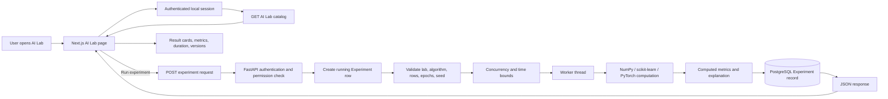

# AI Lab Complete Guide

This guide explains exactly what the **AI Lab** page does, what happens in the frontend and backend, which results are real, which parts are fixed educational content, and what each control means.

AI Lab URL: <http://localhost:3000/ai-lab>

## 1. The direct answer: are the results real or mocked?

The model calculations and metrics are **real**.

- Classical ML experiments actually call scikit-learn and fit models such as Random Forest, Logistic Regression, and KNN.
- The Deep Learning experiment actually trains a small PyTorch neural network.
- The NLP experiment actually builds TF-IDF features and trains a classifier.
- The Transformer experiment performs real inference only when its pretrained tiny model is already available in the local cache.
- Data Lab actually generates, cleans, scales, and summarizes a small tabular dataset.

The results are not hard-coded accuracy numbers and Gemini does not invent them. However, this is an **educational, bounded lab**, not a general training platform:

- it uses generated or library-provided fixture datasets;
- it does not currently accept a custom CSV or user training dataset;
- it trains small CPU-safe models inside the API process;
- it does not save trained model weights or deploy models;
- the beginner explanation shown with a result is fixed explanatory text written for that algorithm, not an LLM-generated answer.

So the accurate description is: **real model execution on controlled teaching data, with computed metrics and a static educational explanation**.

## 2. What happens from click to result



The HTTP request waits for this bounded experiment to finish. The numerical work is moved to a worker thread so the main async API loop is not directly blocked. There is currently no separate job queue or GPU training cluster for AI Lab.

## 3. Every control on the page

### Organization ID and local test user ID

These identify the tenant and authenticated user. The session must have the `chat.execute` permission. Experiment records are scoped to both organization and user, so one tenant cannot request another tenant's experiment through the normal API.

### Lab

This selects an allowlisted family of experiments:

| Lab | Current algorithms |
|---|---|
| Data | Profile |
| Classical ML | Linear Regression, Logistic Regression, Decision Tree, Random Forest, KNN, K-Means, PCA |
| Deep Learning | MLP |
| NLP | TF-IDF Logistic Regression |
| Transformer | Pretrained Inference |

When the lab changes, the frontend selects the first allowed algorithm for that lab.

### Algorithm

This selects the actual backend implementation. The server checks the choice against its allowlist; the browser cannot request arbitrary Python functions, shell commands, source files, or URLs.

### Maximum rows

This is sent as `parameters.max_rows`, but its exact effect depends on the algorithm:

| Experiment | Effect of Maximum rows |
|---|---|
| Data Profile | Controls generated rows, with an additional implementation cap of 500 |
| Linear Regression | Slices the Diabetes dataset; that dataset contains only 442 rows |
| Classical classifiers, K-Means, PCA | Slices Iris; Iris contains only 150 rows |
| Deep Learning MLP | Currently ignored; the full Iris dataset is used |
| NLP | Currently ignored; the fixed 12-sentence fixture is used |
| Transformer | Currently ignored |

For example, entering 300 for Random Forest still uses only the 150 rows available in Iris.

### Epochs

This field is validated and sent with every request, but it has a training meaning only for the **Deep Learning MLP**.

| Experiment | Effect of Epochs |
|---|---|
| PyTorch MLP | Real effect: number of complete training passes over the training set |
| Random Forest | No effect |
| Other classical ML | No effect |
| Data Profile | No effect |
| NLP TF-IDF classifier | No effect |
| Transformer inference | No effect; no fine-tuning occurs |

This is especially important for Random Forest: a forest uses a number of decision trees called `n_estimators`, not epochs. The current web page does not expose the estimator setting, so the backend uses its default of **50 trees**.

### Random seed

The seed controls reproducible random operations such as train/test splitting, forest construction, centroid initialization, and PyTorch initialization. Using the same algorithm, parameters, software versions, and seed should normally reproduce the same result.

A seed is not an accuracy control. Changing it can change the split and result, but it does not inherently make the model better.

### Run experiment

The button sends an authenticated request like this:

```json
{
  "lab_type": "classical_ml",
  "algorithm": "random_forest",
  "dataset": "builtin",
  "parameters": {
    "max_rows": 300,
    "epochs": 8
  },
  "random_seed": 42
}
```

The interface displays a running message while it waits. When the request completes, it displays the returned experiment. The current page shows the latest result; the backend also has tenant-scoped list and detail endpoints for stored experiment history.

## 4. Exact Random Forest example

Suppose you choose:

- Lab: Classical ML
- Algorithm: Random Forest
- Maximum rows: 300
- Epochs: 8
- Random seed: 42

The backend does the following:

1. Loads scikit-learn's built-in Iris flower dataset.
2. Requests up to 300 rows, but Iris has only 150, so it uses 150.
3. Creates a stratified 80/20 split using seed 42: approximately 120 training rows and 30 test rows.
4. Creates a scikit-learn pipeline containing `StandardScaler` and `RandomForestClassifier`.
5. Creates a real forest with 50 decision trees and `random_state=42`.
6. Calls the real scikit-learn `fit` method on the training portion.
7. Calls `predict` on the test portion.
8. Computes accuracy, macro precision, macro recall, macro F1, and a confusion matrix.
9. Runs real three-fold cross-validation and records fold scores and their mean.
10. Records parameters, versions, timing, status, and metrics in PostgreSQL.
11. Returns those stored computed results to the page.

The value `epochs: 8` is accepted but is not read by the Random Forest implementation. Setting it to 1 or 30 does not make the forest train for fewer or more passes. The tree count remains 50 because the page does not currently expose `estimators`.

Iris is small and relatively easy to classify, so a high accuracy is normal. It demonstrates the algorithm; it does not prove that the same model is production-ready for a difficult real-world dataset.

## 5. What each experiment actually runs

### 5.1 Data Profile

This is a real NumPy data-processing demonstration rather than a predictive model.

- Generates seeded numeric features centered around 50.
- Adds a repeating north/south/west category.
- Intentionally injects a missing value and a duplicate.
- Performs mean imputation and standard scaling.
- Creates an 80/20 split.
- Reports feature types, missing values, duplicates, descriptive statistics, a five-row preview, preprocessing steps, and split sizes.

Rows are capped at 500 in this implementation. Epochs are irrelevant.

### 5.2 Linear Regression

- Dataset: scikit-learn Diabetes dataset, at most 442 rows.
- Model: real `LinearRegression` fit.
- Split: seeded 80/20 train/test.
- Metrics: MAE, MSE, RMSE, R-squared, and split sizes.

Maximum rows can reduce the dataset. Epochs are irrelevant because ordinary linear regression here is not trained with an epoch loop.

### 5.3 Logistic Regression

- Dataset: Iris, at most 150 rows.
- Preprocessing: standard scaling.
- Model: real scikit-learn Logistic Regression with a bounded iteration count.
- Evaluation: stratified 80/20 split and three-fold cross-validation.
- Metrics: accuracy, macro precision/recall/F1, confusion matrix, fold scores, and mean cross-validation score.

### 5.4 Decision Tree

- Dataset: Iris.
- Model: real `DecisionTreeClassifier`.
- Default maximum depth: 4.
- Comparison depths: 2, 4, and 6.
- Evaluation: test metrics and three-fold cross-validation.

The backend supports a bounded `max_depth` parameter, but the current page does not expose it, so the default is used.

### 5.5 Random Forest

- Dataset: Iris.
- Model: real `RandomForestClassifier`.
- Default trees: 50; backend cap: 100.
- Evaluation: test metrics and three-fold cross-validation.
- Reproducibility: controlled by the random seed.

Epochs are ignored. The frontend currently does not expose the number of trees.

### 5.6 K-Nearest Neighbors

- Dataset: Iris.
- Preprocessing: standard scaling.
- Model: real KNN classifier.
- Default neighbors: 5; bounded by the backend.
- Comparison values: 3, 5, and 9 neighbors.
- Evaluation: test metrics and cross-validation.

The page does not currently expose the neighbor count, so it uses the default.

### 5.7 K-Means

- Dataset: standardized Iris features without using target labels for training.
- Model: real K-Means clustering with seeded initialization and `n_init=10`.
- Default clusters: 3.
- Metrics: inertia, silhouette score, and cluster membership counts.

K-Means is unsupervised, so its primary result is not ordinary classification accuracy.

### 5.8 PCA

- Dataset: standardized Iris features.
- Operation: real Principal Component Analysis.
- Default components: 2, bounded by the available four Iris features.
- Metrics: explained variance per component, cumulative variance, and component count.

PCA transforms/reduces features; it is not a classifier and does not produce an answer label.

### 5.9 Deep Learning MLP

This is where the Epochs field genuinely matters.

- Dataset: Iris with a stratified 80/20 training/validation split.
- Framework: real PyTorch.
- Network: 4 inputs → 12 hidden units → ReLU → 15% dropout → 3 outputs.
- Loss: cross-entropy.
- Optimizer: Adam with learning rate 0.02 and L2-style weight decay.
- Batch size: 16.
- Evaluation: validation loss and validation accuracy.

For each epoch, the backend:

1. walks through the training data in mini-batches;
2. clears existing gradients;
3. performs a forward pass;
4. calculates cross-entropy loss;
5. calls `loss.backward()` to calculate gradients;
6. calls the Adam optimizer step to update weights;
7. records the mean training loss.

After the requested bounded epochs, it switches to evaluation mode and calculates validation metrics without gradient tracking. The trained weights are not saved after the experiment.

Maximum rows is currently ignored by this implementation; it always uses the small full Iris fixture.

### 5.10 NLP TF-IDF Logistic Regression

- Dataset: a fixed teaching fixture of 12 positive/negative sentences.
- Features: real TF-IDF unigrams and bigrams with English stop-word filtering.
- Model: real Logistic Regression sentiment classifier.
- Split: seeded, stratified train/test split.
- Metrics: accuracy, F1, vocabulary information, and token/feature examples.

Maximum rows and epochs are currently ignored. This tests an actual NLP pipeline, but only on a tiny fixture, so its score should not be treated as a broad sentiment benchmark.

### 5.11 Transformer Pretrained Inference

The configured default is the small `prajjwal1/bert-tiny` model.

- Downloads are disabled by default.
- The backend first tries to load the tokenizer and model from the local Hugging Face cache.
- If cached, it tokenizes bounded input, performs a real no-gradient forward pass, mean-pools the final hidden state, and reports token information and embedding dimensions.
- If not cached, it returns `available: false` with a safe reason. It does not fabricate transformer output.

This experiment does not train or fine-tune a transformer, so epochs have no effect. The current frontend also does not provide a custom text box for this experiment, so the backend uses its built-in default sentence.

## 6. What appears in the result panel

The response can contain:

- experiment ID;
- lab type and algorithm;
- status (`completed` or `failed`);
- random seed;
- submitted parameters;
- calculated metrics;
- duration in milliseconds;
- Python, NumPy, scikit-learn, and PyTorch versions;
- dataset version label;
- educational explanation;
- artifact and isolation metadata.

Numbers between zero and one are rendered with a progress-style bar and rounded display. This is only a generic frontend visualization. It does not understand the semantic meaning of every metric, so a 0–1 value is not always a percentage.

The explanation is a predetermined description of what the selected algorithm teaches. The metrics beside it are the values calculated by the executed experiment.

## 7. Persistence: what is saved and what is not

Each run first creates a PostgreSQL `Experiment` record with `running` status. On completion or failure, the same record is updated with its final status and safe result information.

Saved information includes:

- tenant organization and user ownership;
- experiment type, algorithm, dataset label, and version;
- submitted parameters and random seed;
- status, timestamps, and duration;
- calculated metrics;
- runtime library versions;
- sanitized failure code if the run fails.

Not saved by the current AI Lab implementation:

- trained Random Forest/MLP/classifier model files;
- PyTorch weights;
- a fitted scaler or preprocessing pipeline artifact;
- user-uploaded training data;
- transformer weights downloaded by the application;
- a deployed model endpoint.

The response therefore correctly reports artifact storage as `none`. A local artifact-store adapter exists in the codebase, but it is not wired into these current AI Lab runs.

## 8. Dataset selection: an important current limitation

The backend catalog describes generated profile, Iris, Diabetes, and sentiment fixture datasets. The page does not currently show a dataset selector. It sends `builtin` for most labs and `sentiment_fixture_v1` for NLP.

More importantly, the current backend selects its fixture from the lab and algorithm implementation. The `dataset` request field is recorded as metadata; it is not a general loader that can open any named or uploaded dataset.

Therefore:

- choosing Random Forest always uses Iris;
- choosing Linear Regression always uses Diabetes;
- choosing NLP always uses its 12-sentence fixture;
- AI Lab does not use PDFs uploaded to Knowledge Bases;
- AI Lab does not currently train from CSV files or a production database.

## 9. AI Lab versus Chat and RAG

AI Lab is intentionally isolated from the production document-answering path.

| AI Lab | Chat/RAG |
|---|---|
| Runs educational ML experiments | Answers questions from knowledge sources |
| Uses NumPy, scikit-learn, PyTorch, optional cached transformer | Uses LangGraph, Vertex embeddings, Pinecone, and Gemini |
| Uses built-in/generated fixtures | Uses uploaded and indexed documents or approved data sources |
| Produces metrics | Produces grounded natural-language answers and citations |
| Does not change Pinecone | Retrieves production vectors from Pinecone |
| Does not deploy trained models | Invokes configured model providers for answers |

An AI Lab experiment does **not** call LangGraph, Gemini, Vertex embeddings, or Pinecone. It also does not modify a Knowledge Base.

## 10. Backend safeguards

The current implementation applies these controls:

- authenticated `chat.execute` permission;
- organization/user ownership checks;
- strict lab and algorithm allowlists;
- bounded row count and epochs;
- default maximum of 30 epochs;
- default maximum of 5,000 requested rows, with smaller dataset-specific limits;
- default 30-second wall-clock timeout;
- default two concurrent lab executions per API process;
- seeded operations for repeatability;
- small, CPU-oriented implementations;
- transformer downloads disabled by default;
- no arbitrary source code, shell, filesystem path, or URL input;
- no production KB/Pinecone mutation;
- sanitized failure information returned to clients.

One technical nuance: the API timeout stops waiting for a worker-thread result, but Python cannot always terminate an already-running thread immediately. The bounded models are intentionally small to limit that risk. The semaphore is also local to one API process rather than distributed across all possible replicas.

## 11. Why an experiment might fail or appear surprising

### Random Forest does not change when I change epochs

That is expected in the current implementation. Epochs are irrelevant to Random Forest. Change the random seed or row count to alter inputs/splits. A future UI could expose the tree count, but it does not today.

### Maximum rows 300 still reports 150 Iris rows

Iris contains 150 rows. Maximum rows is an upper bound, not a data generator for classical ML.

### A small Iris row count can fail

Iris is ordered by class in its source dataset. Slicing a very small prefix may omit one or more classes, making stratified splitting or cross-validation invalid. For reliable Iris classification demonstrations, use approximately 120–150 requested rows. The default 300 safely resolves to all 150 rows.

### Transformer says unavailable

The optional tiny model is not cached locally and downloads are disabled. This is an honest availability result, not a mock answer. Enabling downloads changes runtime/network behavior and should be a deliberate environment decision.

### Scores are unusually high

The teaching datasets are small and clean, especially Iris. High fixture accuracy is possible and is not evidence of general real-world performance.

### The page waits until completion

The current system runs the work within the API service and returns after it completes. It does not submit the run to a background training queue. The “running” message is frontend state while the request is in progress.

### Old results are not all visible on this page

The backend persists and can list experiments, but the current AI Lab workspace emphasizes the latest result rather than presenting a complete history table.

## 12. Recommended demonstrations

### Demonstrate a real Random Forest

Use:

- Classical ML → Random Forest
- Maximum rows: 150 or 300
- Epochs: any valid value; explain that it is ignored
- Seed: 42

Point out the test metrics, confusion matrix, cross-validation folds, duration, and runtime versions.

### Demonstrate epochs correctly

Use:

- Deep Learning → MLP
- Epochs: 5, then 20
- Seed: keep the same value

Compare the training-loss history and validation metrics. This is the experiment designed to demonstrate epoch-based iterative training.

### Demonstrate unsupervised learning

Use Classical ML → K-Means or PCA. Explain that clustering quality and explained variance are different from classification accuracy.

### Demonstrate reproducibility

Run the same experiment twice with identical inputs and seed. Then change only the seed and compare. Small floating-point/runtime differences can exist between platforms, especially for PyTorch, but seeded behavior is designed to be repeatable.

## 13. Current implementation map

| Concern | File |
|---|---|
| AI Lab dynamic page route | `apps/web/app/[section]/page.tsx` |
| Form, catalog loading, request, latest result | `apps/web/components/ai-lab-workspace.tsx` |
| Result rendering | `apps/web/components/experiment-results.tsx` |
| Experiment API endpoints | `apps/api/src/dynamic_agentic_api/api/experiments.py` |
| Request/response validation | `apps/api/src/dynamic_agentic_api/schemas.py` |
| Algorithm implementations | `apps/api/src/dynamic_agentic_api/ai_lab/service.py` |
| Persistence/orchestration | `apps/api/src/dynamic_agentic_api/experiments/service.py` |
| Experiment database model | `apps/api/src/dynamic_agentic_api/db/models.py` |
| AI Lab limits/configuration | `apps/api/src/dynamic_agentic_api/config.py` |
| Backend behavior tests | `tests/backend/test_milestone4_ai_lab_evaluation.py` |

The main endpoints are:

```text
GET  /api/v1/organizations/{organization_id}/ai-lab/catalog
POST /api/v1/organizations/{organization_id}/ai-lab/experiments
GET  /api/v1/organizations/{organization_id}/experiments
GET  /api/v1/organizations/{organization_id}/experiments/{experiment_id}
```

## 14. Final interpretation

AI Lab genuinely executes the implemented algorithms and calculates their metrics. It is intentionally small, reproducible, tenant-scoped, and isolated from production RAG data.

For the specific Random Forest example:

- the forest is real;
- the fit, prediction, and metrics are real;
- the dataset is the built-in Iris teaching dataset;
- the current default is 50 trees;
- the Epochs box has no effect;
- the written educational explanation is static;
- the model itself is not saved or deployed;
- the experiment record and metrics are saved in PostgreSQL.

That makes the page suitable for demonstrating AI/ML concepts safely, but it should not be presented as a full custom-dataset model-training or MLOps platform.
