# Architecture

Status: APPROVED BASELINE - Milestone 3 implemented, acceptance in progress
Last updated: 2026-08-28
Decision authority: Phase 0 through Milestone 3 approved by the project owner

## 1. Architectural drivers

The platform must combine authorized document RAG, approved structured data, deterministic mathematics, dynamic personas and LLMs, reliable citations/page previews, suggested questions, and safe live execution traces. It must also host an isolated AI Lab and Evaluation Center without turning educational experiments into production dependencies.

The primary drivers are tenant isolation, evidence grounding, safe tool use, extensibility, asynchronous ingestion, horizontal scaling, model/provider portability, end-to-end attribution, and GCP readiness. Pinecone is mandatory for production vectors. PostgreSQL is the system of record and first structured-data connector. Gemini through Vertex AI is the initial production LLM and Vertex AI embeddings are initially preferred, while provider abstractions remain mandatory. The API is stateless where practical and all expensive work is queued.

## 2. Overall application architecture

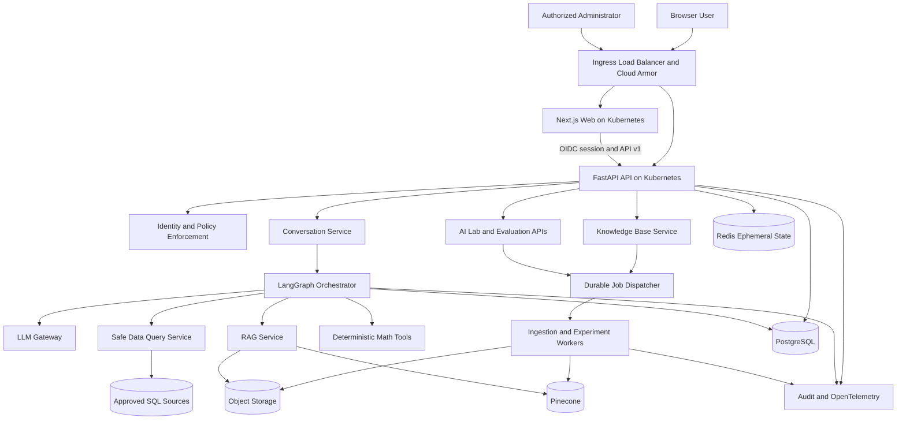

The web application never directly accesses provider secrets, Pinecone, customer databases, Redis, or storage objects. Time-limited previews are issued only after API authorization. Production and AI Lab workloads share platform primitives but use separate policies, queues, artifacts, resource quotas, and service interfaces.

## 3. Service/container boundaries

- **Web:** Next.js/React/TypeScript, responsive three-panel chat and the eight product areas. It renders sanitized Markdown and safe trace events.
- **API:** FastAPI/Pydantic/SQLAlchemy. Owns authentication integration, authorization, tenancy, resources, conversation APIs, signed artifact access, stable errors, and synchronous orchestration entry points.
- **Agent runtime:** a Python module deployed with the API initially but bounded behind an internal interface so it can become a separate service if scaling or isolation demands it.
- **Ingestion workers:** file validation results, parsing/OCR, page rendering, chunking, embedding, Pinecone updates, and deletion/reindexing.
- **Experiment/evaluation workers:** resource-bounded AI Lab and batch evaluation jobs, isolated from latency-sensitive ingestion and chat.
- **Safe data-query service:** connector catalog, schema snapshots, query-intent compilation, SQL policy validation, read-only execution, bounded result shaping, and audit.
- **LLM gateway:** provider-neutral request/response contract, capability registry, policy checks, structured output validation, retries, fallback, usage, cost, and attribution.
- **Stores:** PostgreSQL for durable relational state, Cloud Storage for immutable/large artifacts, Pinecone for vectors, Redis for non-authoritative ephemeral state, and Pub/Sub for delivery of durable job references.

## 4. LangGraph architecture

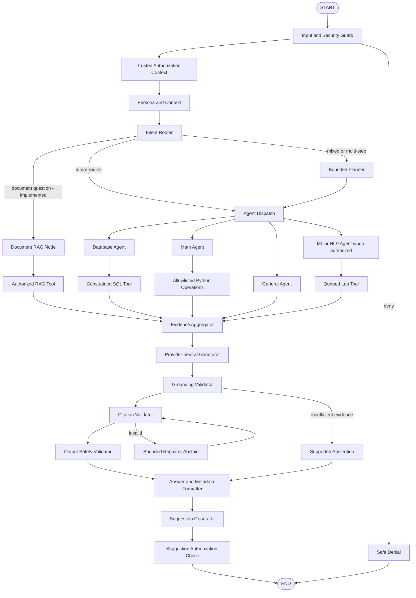

### Graph state and execution model

State is typed, versioned, and minimal: request/trace IDs; trusted actor and authorization scope; selected persona/provider policy; normalized intent and plan; bounded conversation context; tool requests/results; evidence/citations; validation outcomes; safe trace events; token/cost budgets; and errors. Raw secrets and hidden model reasoning never enter persisted graph state.

Routing uses deterministic rules for obvious commands plus schema-constrained model classification for ambiguous language. The planner is invoked only for mixed/multi-step work. Tool authorization and validation occur in trusted code regardless of the graph's proposed route. Checkpoints contain references to large results rather than payload copies and obey tenant retention policy.

## 5. Production RAG architecture

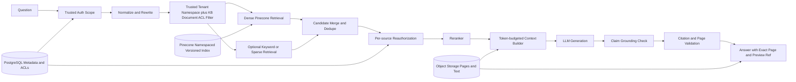

Pinecone is the production semantic index. Recommended isolation is one index per environment and embedding compatibility version with one namespace per tenant, then mandatory KB/document/permission metadata filters inside that namespace. The namespace is derived from trusted authorization context, never browser input. A physical index-per-tenant option is reserved for regulated tenants requiring independent region, lifecycle, or account controls. Vector metadata is bounded and filter-oriented; PostgreSQL/object storage remain authoritative for permissions and full artifacts.

Hybrid retrieval is an extension, not a prerequisite for the first valid RAG path. Reranking is configurable and evaluated before enablement. Authorization is compiled from server-trusted membership and resource policies, pushed into the retrieval filter, and rechecked against the authoritative ACL before context construction and again before preview disclosure.

## 6. Document ingestion architecture

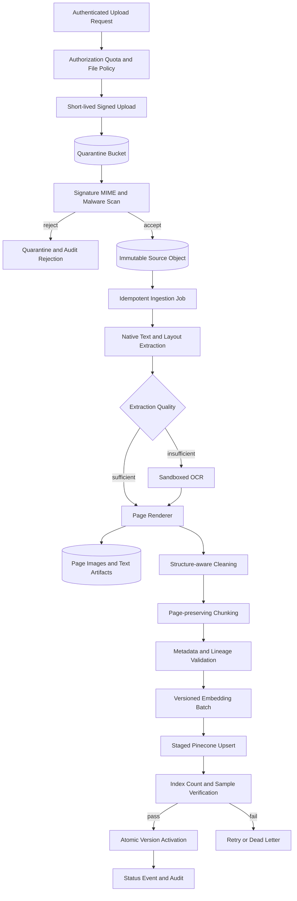

OCR extracts text from scanned pages; page screenshots are created by deterministic rendering. Each derivative includes document version, parser, OCR, renderer, chunker, embedding model/version, index version, timestamps, checksums, and page coordinates where available. Jobs use an idempotency key based on document version plus pipeline version. New indexes are staged and activated atomically; old versions remain readable only for a bounded rollback period, then are deleted by audited lifecycle jobs.

## 7. Data architecture

### PostgreSQL domains

PostgreSQL stores organizations, users, identities, memberships, roles/permissions, knowledge bases, documents/versions/pages/chunks, ACLs, data-source and schema metadata, conversations/messages, personas, provider/model references, prompt versions, graph versions, ingestion/experiment/evaluation jobs, evaluation datasets/runs/cases, usage records, artifact references, and audit events. Tenant-owned tables carry `organization_id`; row-level security is considered defense-in-depth but never replaces service authorization.

Operational writes use migrations, transactions, foreign keys, constraints, and optimistic version fields. Large source text, page renders, datasets, and model artifacts use Cloud Storage with database references and checksums. Audit events may be streamed to a separately retained append-only sink.

### Pinecone model

Index identity: `{environment}-{embedding_family}-{dimension}-{index_version}`. Each tenant uses its own namespace within a compatible index; KB/document/ACL partitions are enforced through metadata filters, with redundant `tenant_id` metadata checked as defense in depth. Representative metadata:

```text
tenant_id, knowledge_base_id, document_id, document_version_id,
chunk_id, filename, title, section, page_number, source_type,
visibility, acl_partition_ids, ingestion_version, parser_version,
chunker_version, embedding_model, embedding_version, object_text_ref,
page_image_ref, content_checksum, created_at
```

Do not store presigned URLs, credentials, unrestricted ACL lists, or oversized page text in vector metadata. Deleting a document first revokes visibility in PostgreSQL, then invalidates caches and removes vectors/artifacts asynchronously; authorization rechecks close the deletion window.

### Redis and queue

Redis holds short-lived rate-limit counters, distributed locks, safe caches, stream cursors, and optional LangGraph ephemeral checkpoints. Cache keys include environment, tenant, actor/permission fingerprint where needed, resource/version, index/model/prompt/graph versions, and query hash. Pub/Sub transports job IDs, not authoritative job state. PostgreSQL is the durable job/status ledger; workers use leases and idempotency records. Separate queues isolate ingestion, embeddings, experiments, evaluations, and deletion.

## 8. Multi-LLM/provider architecture

```text
LLMGateway
  -> PolicyResolver (tenant, persona, classification, residency, budget)
  -> CapabilityRegistry (structured output, tools, context, modalities)
  -> ProviderAdapter (OpenAI | Anthropic | DeepSeek | future)
  -> OutputValidator
  -> UsageAndAttribution
```

The gateway accepts a normalized request containing prompt-version reference, role-separated messages/evidence, response schema, allowed tools, timeout, budget, and fallback policy. It returns validated content/tool proposals plus actual provider, model, latency, usage, cost estimate, retries, safety outcome, and request reference. Provider secrets are resolved server-side from Secret Manager. Adapters translate only at the boundary.

Fallback occurs on classified transient/capability failures and only to a policy-approved model. No fallback may silently cross a prohibited provider, region, retention policy, or data classification. Routing/classification should use the smallest model that meets evaluated quality; generation and verification model choice is persona/policy driven.

Gemini through Vertex AI is the initial production primary. Other providers remain pluggable through the gateway. Sensitive data must never fall back to an external provider unless the tenant/model policy explicitly permits that destination.

## 9. Security boundaries

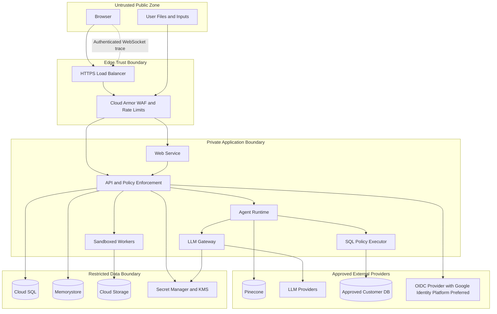

### Security model

- **Identity:** enterprise-compatible OIDC/OAuth2 Authorization Code + PKCE behind a provider abstraction; Google Identity Platform is preferred on GCP. Server-managed secure sessions or short-lived tokens, IdP-managed MFA, revocation/session invalidation, and workload identity prevent domain coupling to provider claims.
- **Authorization:** RBAC plus resource attributes. Policy decisions derive organization membership, role, resource ACL, data classification, tool permission, and tenant provider policy. Deny by default.
- **Network:** only the external load balancer/Ingress is public. GKE uses default-deny NetworkPolicy, narrowly allowed service/egress paths, Kubernetes RBAC, Workload Identity, and private Cloud SQL/Memorystore access. External Pinecone/LLM egress uses TLS and provider allowlists; Private Service Connect is preferred when supported and justified.
- **Secrets/crypto:** Secret Manager references, KMS-backed encryption, rotation, workload identity, TLS, encrypted storage/backups, and no long-lived service-account keys.
- **Uploads:** quarantined bucket, content validation/malware scan, resource quotas, parsing isolation, immutable source object, signed access, and lifecycle/retention controls.
- **Agent/tool boundary:** model output is a proposal. Trusted policy code validates identity, authorization, schema, bounds, timeout, and destination before execution.
- **Prompt injection:** strict instruction/evidence separation, content risk labeling, minimum tool privileges, no secrets in model context, and output/citation checks. Document text never gains instruction priority.
- **Audit/privacy:** append-oriented events with trace IDs and redacted metadata, separate access controls, retention/deletion policies, and security alert export.

Threats explicitly addressed include cross-tenant IDOR/retrieval/cache leakage, prompt injection, SQL injection/unsafe generated SQL, malicious uploads/parser exploits, SSRF through connectors or model URLs, XSS in answers, secret leakage, tool escalation, fabricated citations, replay/duplicate jobs, dependency compromise, denial of service, and audit tampering. Detailed control and test mappings live in `Design.md` and `ProjectRequirements.md`.

## 10. Scalability architecture

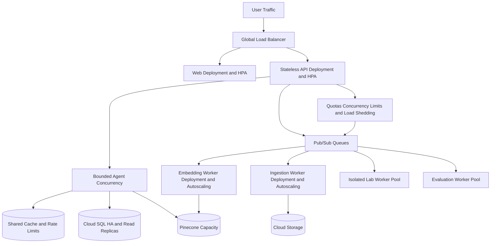

Web/API pods scale with HPA from CPU, memory, latency, and custom concurrency metrics. Worker pools scale independently from queue depth/age; lab workloads have strict quotas and do not consume chat capacity. Pod disruption budgets, topology spread, requests/limits, readiness/startup probes, and graceful termination protect availability. Cloud SQL scales vertically first with connection pooling, indexed access, partitioning/archival where justified, and read replicas for suitable reads. Storage and Pub/Sub are managed elastic services. Pinecone capacity is sized and monitored independently.

Backpressure is mandatory: per-tenant and per-user limits, maximum upload/page/token/result sizes, bounded agent steps, concurrency semaphores for providers/databases, and queue admission limits. Hot-path caches are permission- and version-aware. WebSocket trace connections use authenticated handshakes, strict origin checks, heartbeat, reconnect cursors, bounded buffers, and finite retention; event history lives outside individual API instances.

Availability target is not yet approved. The proposed baseline uses a regional multi-zone GKE cluster, regional HA Cloud SQL, replicated managed storage, retryable Pub/Sub delivery, provider circuit breakers, and regional deployment. Multi-region active-active is deferred until residency, RTO/RPO, and load justify its complexity.

## 11. GCP deployment architecture

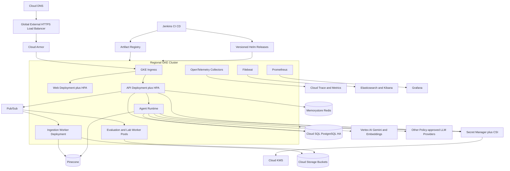

Local Kubernetes uses kind. The authoritative cloud target is GKE, delivered with Helm and Jenkins from immutable Artifact Registry images. Production pods run as non-root with read-only filesystems where practical, dropped Linux capabilities, resource bounds, service-account-specific Workload Identity, Kubernetes RBAC, default-deny NetworkPolicy, and Secret Manager CSI/runtime secret access. Prometheus/Grafana, ELK/Filebeat, and OpenTelemetry provide the required observability stack. These deployment assets are intentionally deferred to the deployment milestone.

Recommended environment isolation is separate GCP projects for development, staging, and production, with separate service accounts, databases, buckets, secrets, queues, Pinecone indexes/namespaces, budgets, and telemetry labels. Exact GKE topology and capacity are selected in the deployment milestone after SLO and load evidence exist.

Cloud Storage buckets are separated by quarantine, originals, processed pages/chunks, lab artifacts, and exports with lifecycle/retention policies. Cloud SQL uses private IP, HA, automated backups/PITR, and connection pooling. CI uses workload identity federation, signed provenance where available, staged promotion, smoke/security gates, canary traffic, and rollback.

## 12. End-to-end data flow

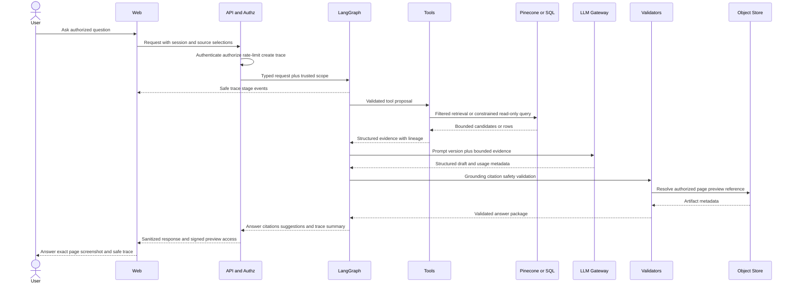

All paths are correlated by `request_id`, `trace_id`, tenant, actor, graph version, prompt version, model/provider, and KB/index version. Tool and evidence payloads are bounded and may be stored as encrypted artifacts with references. Data sent to a provider is minimized and governed by tenant policy.

## 13. Observability, reliability, and failure handling

OpenTelemetry spans cross edge, API, graph nodes, tools, providers, workers, PostgreSQL, Pinecone, and object operations. Metrics cover API rate/error/p50/p95/p99, active streams, provider latency/tokens/cost/retry/fallback, retrieval latency/empty results/citation rate, queue depth/age/retries/DLQ, DB pool/query latency, cache hits, authorization denials, and suspicious tool/prompt events. Audit events are distinct from debug logs.

Failures are classified as validation, authentication, authorization, not-found, conflict, quota/rate, timeout, dependency unavailable, ingestion, policy denial, and internal error. External calls use deadlines and bounded retry policies; non-idempotent operations are not blindly retried. Circuit breakers prevent cascades. Suggestions, reranking, and detailed trace streaming may degrade independently; absence of evidence or authorization never degrades into an ungrounded answer.

## 14. Caching strategy

- Cache stable provider/model capabilities and prompt metadata briefly.
- Cache retrieval or read-only data results only when the key includes tenant and permission fingerprint plus source/index/model versions.
- Do not cache signed URLs, secrets, raw session tokens, authorization decisions beyond their safe TTL, or mutable job truth.
- Invalidate on permission, document, KB, prompt, graph, model, or index version changes. Permission changes publish invalidation and authorization is still rechecked before disclosure.
- Use request-local memoization before distributed caching; evaluate benefit and leakage risk before enabling a cache.

## 15. Architecture decisions

| ID | Decision | Status | Rationale / consequence |
|---|---|---|---|
| ADR-001 | Python/FastAPI primary AI backend; Next.js/TypeScript web | Accepted | Matches AI ecosystem and mandatory UI direction; two typed ecosystems require generated/shared contracts. |
| ADR-002 | PostgreSQL system of record and first structured-data connector; object storage for large artifacts | Accepted | Strong relational tenant/audit integrity; MongoDB/NoSQL remains a later explicit requirement. |
| ADR-003 | Pinecone production vectors; FAISS/Chroma lab-only | Required | Direct product/master requirement and curriculum comparison boundary. |
| ADR-004 | LangGraph typed orchestration with trusted policy/tool gates | Accepted | Extensible routing while keeping security out of model discretion. |
| ADR-005 | Pub/Sub plus PostgreSQL durable job ledger; Redis non-authoritative | Accepted for later phase | GCP-native elastic delivery with explicit status/idempotency; neither is implemented in Phase 1. |
| ADR-006 | WebSocket for live trace/progress | Accepted/Required | Implements the explicit Dynamic Agentic Systems protocol requirement with authenticated safe events. |
| ADR-007 | kind locally and GKE in cloud; Helm/Jenkins delivery | Accepted/authoritative | Cloud Run is not the final target. Exact region, capacity, RTO, and RPO remain deferred. |
| ADR-008 | One Pinecone index per environment/embedding compatibility version, one namespace per tenant | Accepted | Narrows query scope/cost and cross-tenant risk; mandatory KB/document authorization metadata remains. |
| ADR-009 | Deterministic page rendering; OCR only when native extraction is insufficient | Accepted | Rendering preserves visual fidelity and OCR remains an extraction fallback. |
| ADR-010 | PostgreSQL-first connector and adapter seam for later MongoDB/NoSQL | Accepted | Establishes the first safe structured-data path while retaining extensibility. |
| ADR-011 | Provider-neutral OIDC/OAuth2 with Google Identity Platform preferred | Accepted | Keeps domain identity provider-independent while selecting a GCP production preference. |
| ADR-012 | Gemini through Vertex AI primary; Vertex AI embeddings preferred | Accepted | Establishes an initial GCP-native model path while retaining gateway portability. |
| ADR-013 | Admin-only server-side provider credentials | Accepted | Minimizes secret exposure and separates privileged configuration. |
| ADR-014 | Baseline dense RAG before evaluated reranking | Accepted | Establishes a measurable baseline before adding complexity. |

Deferred deployment, retention, provider-policy, connector-network, and financial-data decisions are maintained in `ProjectRequirements.md`.

## 16. Milestone 2 implementation boundary

The working slice now comprises authenticated tenant-scoped KBs and PDF uploads; local replaceable object storage; deterministic PyMuPDF extraction/rendering; page-preserving recursive chunks; Vertex embedding, Pinecone, and Gemini adapters; PostgreSQL metadata authorization; a typed six-node LangGraph; grounded/unanswerable responses; exact citation previews; persisted allowlisted WebSocket trace events; and usable KB/chat web surfaces. Test fakes are enabled only in `APP_ENV=test`; managed mode requires ADC and Pinecone configuration. Ingestion currently runs as an in-process background task and local storage is development-only. Durable workers, Cloud Storage, OCR implementation, reranking, and deployment remain later work.

## 17. Milestone 3 product-intelligence architecture

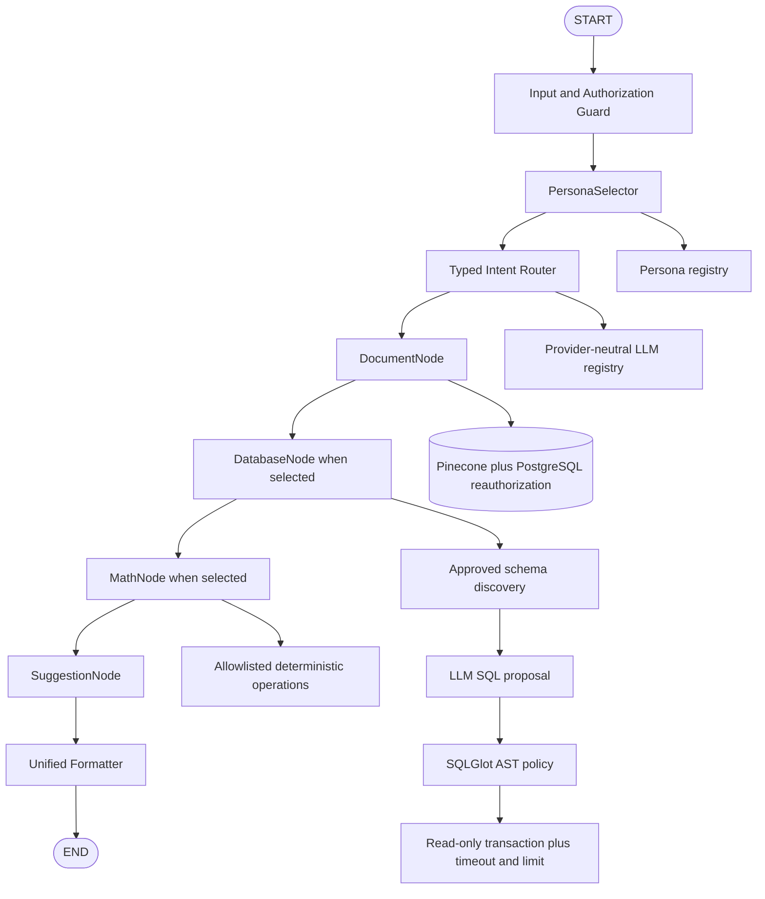

Milestone 3 implements a typed `PersonaSelector -> Router -> DocumentNode -> DatabaseNode -> MathNode -> SuggestionNode -> Formatter` graph. Route nodes are composable and no model receives connection access. The PostgreSQL connector decrypts credentials only inside the backend, discovers only allowlisted schema/table metadata, validates a single SELECT/read-only CTE AST, qualifies approved tables, limits rows, sets a statement timeout, and executes inside a read-only transaction. The application database and queryable demo data are logically separated into application tables and the `demo_business` schema; production sources should additionally use independently provisioned read-only roles/databases.

The LLM registry allowlists provider/model pairs. Vertex AI Gemini remains available and primary; OpenAI and Anthropic capabilities are visible but unavailable until real adapters and credentials are configured. Manual selections are server-validated, while persona defaults drive AUTO behavior. Trace summaries now include only allowlisted persona, route, row-count, operation, citation-count, provider/model, timing, and status metadata.

## 18. Milestone 4 AI Lab and Evaluation architecture

The AI Lab is a tenant-scoped sidecar domain, not a node in the production LangGraph. It shares authentication, PostgreSQL, safe settings, logging, and provider interfaces, while its generated/built-in datasets and local evaluation vectors cannot mutate production knowledge bases, Pinecone namespaces, data sources, or chat state. Runs are bounded by dataset, epoch, wall-clock, and concurrency settings. Metadata and small JSON metrics are stored in PostgreSQL; the `ArtifactStore` interface provides a development-only local JSON implementation for future object-storage artifacts without placing model binaries in the database.

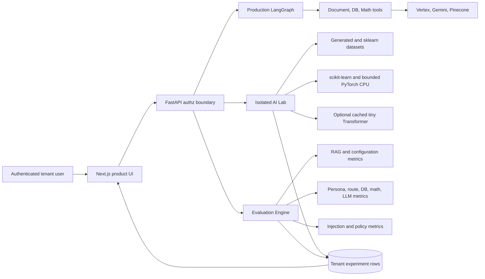

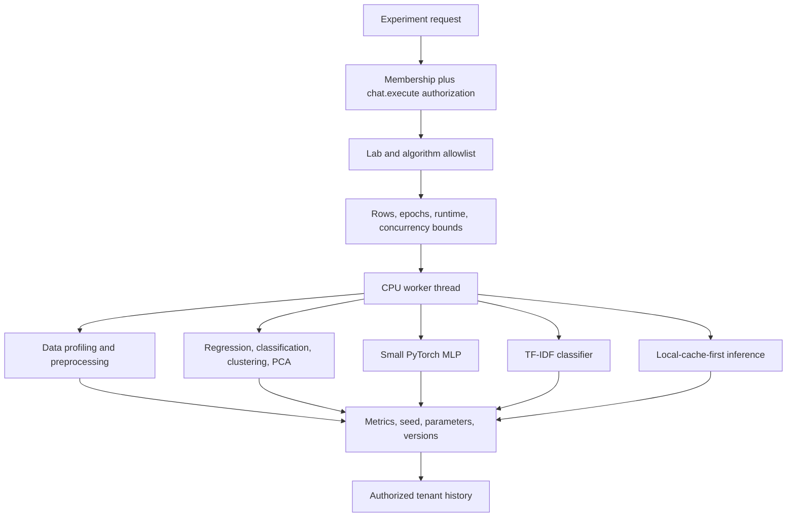

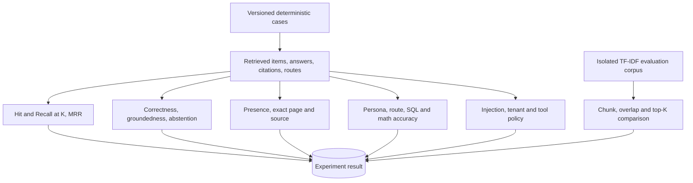

Security boundaries remain server-derived: experiment organization/user IDs come from the authenticated context, history queries always include `organization_id`, and failures return the existing sanitized envelope. Connector destinations are restricted to `DATA_SOURCE_ALLOWED_HOSTS`; uploaded documents require PDF MIME, `.pdf` extension, signature, size and page bounds; ingestion also caps chunk count. Document/database values remain untrusted evidence, and no lab exposes arbitrary files, URLs, Python, shell, model training code, or production-vector writes.

Application-level observability emits structured completion events with tenant-safe experiment ID, category, algorithm/benchmark, status, and duration. Existing request correlation and graph stage timings cover production operations. Prometheus, Grafana, ELK, OpenTelemetry collectors, Kubernetes, GKE, Helm, and Jenkins remain Milestone 5 work and are not introduced here.
