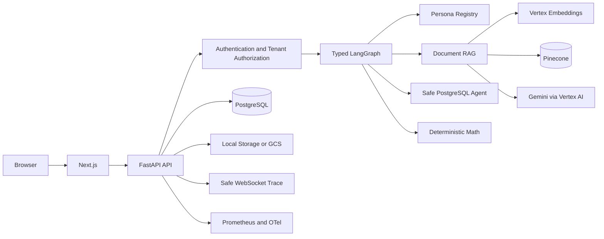
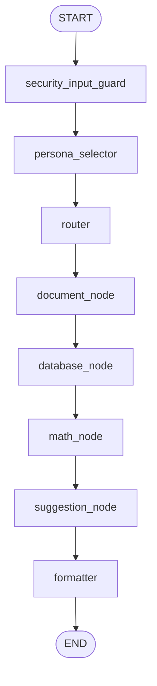
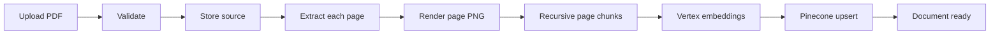

# Dynamic Agentic Bot — Complete Implementation and Concepts Guide

Last verified: 2026-08-30

This document explains how the entire project was designed and implemented, where each major capability lives in the repository, how the LangGraph agent works, how the numbered AI curriculum is represented, and which software engineering, security, cloud, Kubernetes, DevOps, MLOps, RAG, evaluation, and observability concepts are used.

If you first need plain-language explanations of organization/user IDs and every website page, read [BeginnerStepByStepGuide.md](BeginnerStepByStepGuide.md).

Use this together with:

- [CompleteProjectGuide.md](CompleteProjectGuide.md) for installation, URLs, running, deployment, and troubleshooting.
- [ProjectRequirements.md](ProjectRequirements.md) for the authoritative requirement list and topic-by-topic curriculum matrix.
- [Architecture.md](Architecture.md) and [Design.md](Design.md) for the approved architectural baseline.
- [Rules.md](Rules.md) for mandatory security and engineering rules.

## 1. Project objective and final product

The project converts the “Dynamic Agentic Systems” specification into a secure multi-tenant web application where an authenticated user can:

1. Create a tenant-owned knowledge base.
2. Upload a PDF.
3. Extract and render every page.
4. Split text into page-preserving chunks.
5. create Vertex AI embeddings.
6. Store/query vectors in Pinecone.
7. Ask questions through a typed LangGraph workflow.
8. Dynamically select a persona and document/database/math route.
9. Generate a grounded Gemini response.
10. Validate every cited chunk against authorized retrieved evidence.
11. Open the exact rendered PDF page.
12. View safe WebSocket execution stages.
13. Receive an abstention when evidence is insufficient.
14. Register an encrypted, read-only PostgreSQL source.
15. Run isolated AI Lab experiments and evaluation benchmarks.

The application is not merely a chatbot. It combines application engineering, authorization, RAG, structured-data tools, deterministic calculations, AI evaluation, security controls, cloud infrastructure, CI/CD, and observability.

## 2. How the project was completed by milestone

### Phase 0 — discovery and architecture

The specification and AI curriculum were converted into:

- functional and non-functional requirements;
- a 122-topic curriculum traceability matrix;
- security, scaling, RAG, LangGraph, provider, database, GCP, and repository designs;
- living architecture, design, memory, phases, requirements, and rules documents.

No application code was created until the architecture baseline was approved.

### Milestone 1 — secure foundation

Implemented:

- FastAPI and Next.js foundations;
- Pydantic settings and safe environment validation;
- PostgreSQL with SQLAlchemy and Alembic;
- organization, user, membership, role, and permission schema;
- provider-neutral authentication boundary;
- server-side tenant authorization;
- structured errors, request IDs, safe logging, security headers;
- health/readiness endpoints;
- Docker Compose PostgreSQL;
- backend/frontend quality gates.

### Milestone 2 — production document RAG

Implemented:

- KB create/list;
- PDF upload/list/reindex;
- validation, object storage, extraction, previews, chunking;
- Vertex embeddings and Pinecone;
- authorized retrieval and Gemini generation;
- citation validation, abstention, exact-page preview;
- initial LangGraph document workflow;
- persisted safe WebSocket events;
- usable Knowledge Base and Chat interfaces.

### Milestone 3 — full product intelligence

Implemented:

- personas and automatic/manual selection;
- provider/model allowlist;
- multi-route LangGraph;
- encrypted PostgreSQL sources;
- LLM-proposed but policy-validated SELECT queries;
- deterministic math operations;
- database, document, and math evidence aggregation;
- safe follow-up suggestions;
- expanded chat interface and trace.

### Milestone 4 — AI Lab, evaluation, hardening

Implemented:

- bounded Data, Classical ML, Deep Learning, NLP, and Transformer labs;
- reproducible parameters, seeds, library versions, metrics, and experiment history;
- RAG, RAG comparison, persona/router, database, math, security, LLM, and prompt evaluations;
- AI Lab and Evaluation Center web interfaces;
- PDF and connector hardening;
- adversarial and cross-tenant tests;
- honest curriculum status classification.

### Milestone 5 — production delivery and observability

Implemented:

- hardened multi-stage containers;
- Docker Compose and local Kind;
- shared Helm charts and environment overlays;
- Jenkins CI/CD;
- private Artifact Registry and immutable commit-SHA images;
- GKE Autopilot;
- Cloud SQL and Cloud SQL Auth Proxy;
- GCS storage;
- Secret Manager CSI and Workload Identity Federation;
- Kubernetes security contexts, RBAC, NetworkPolicies, HPA, PDB, and probes;
- Prometheus, Grafana, Elasticsearch, Logstash, Filebeat, Kibana, and OpenTelemetry;
- rollout, smoke testing, rollback, recovery, and cleanup documentation.

## 3. Complete runtime architecture



### Responsibility boundaries

| Layer | Technology | Responsibility |
|---|---|---|
| Browser | React/Next.js/TypeScript | Session form, KBs, upload, chat, citations, previews, AI Lab, evaluations |
| API | FastAPI/Pydantic | Validation, authentication, authorization, endpoints, safe errors |
| Persistence | SQLAlchemy/Alembic/PostgreSQL | Tenants, RBAC, documents, chunks, runs, traces, experiments |
| Agent runtime | LangGraph | Typed state and controlled route execution |
| LLM abstraction | Provider protocol/registry | Allowlisted model resolution and structured results |
| RAG | Vertex/Pinecone/Gemini | Embed, retrieve, build context, answer, cite, abstain |
| Data Agent | SQLGlot/asyncpg | Validate and execute read-only bounded SQL |
| Math Agent | Deterministic Python | Safe arithmetic and statistics |
| Storage | Local adapter/GCS | Source PDFs, page previews, extracted text, chunks, lab artifacts |
| Operations | Docker/Helm/Kubernetes/GCP | Build, deploy, secure, scale, observe, rollback |

## 4. Frontend implementation

Location: `apps/web/`

### Important files

| File | Purpose |
|---|---|
| `app/layout.tsx` | Root application layout |
| `app/page.tsx` | Landing route |
| `app/[section]/page.tsx` | Selects the correct workspace for each product area |
| `components/app-shell.tsx` | Navigation and page shell |
| `components/platform-session.tsx` | Explicit local/private test-session connection |
| `components/knowledge-base-workspace.tsx` | KB creation, document upload, status table |
| `components/chat-workspace.tsx` | Persona/model/source controls, chat, citations, preview, trace |
| `components/ai-lab-workspace.tsx` | Experiment controls and results |
| `components/evaluation-workspace.tsx` | Benchmark controls and history |
| `lib/api-client.ts` | Credentialed HTTP requests, API URLs, WebSocket URLs |
| `lib/platform-types.ts` | TypeScript API contracts |
| `lib/sections.ts` | Navigation catalog |

### Browser-to-API behavior

`apiRequest()`:

- uses the configured API base URL;
- sends cookies with `credentials: "include"`;
- sets JSON content type unless the body is `FormData`;
- expects a stable error envelope;
- never contains server/provider credentials.

`websocketUrl()` converts `http`/`https` to `ws`/`wss`. The chat opens the authorized trace socket before executing the run so stages can arrive live.

### Implemented and informational pages

- `/knowledge-base`, `/chat`, `/ai-lab`, and `/evaluation` are functional.
- `/agents`, `/security`, and `/admin` currently render an informational foundation state. Backend concepts exist, but complete management consoles do not.

## 5. Backend API implementation

Location: `apps/api/src/dynamic_agentic_api/`

### Application startup

`main.py`:

- creates FastAPI;
- conditionally exposes OpenAPI only in development/test;
- installs CORS and trusted-host middleware;
- installs request context and exception handlers;
- includes the versioned API router;
- configures structured logging and OpenTelemetry;
- exposes `/health` and `/metrics`.

### Router boundaries

| File | Boundary |
|---|---|
| `api/auth.py` | Test-only session creation |
| `api/organizations.py` | Authorized tenant context |
| `api/knowledge.py` | KBs, documents, upload, reindex, preview |
| `api/chat.py` | Chat-run creation/execution and WebSocket trace |
| `api/intelligence.py` | Personas, models, data sources |
| `api/experiments.py` | AI Lab, evaluations, experiment history |
| `api/health.py` | Health and readiness |

### Dependency composition

`services.py` is the composition root. It chooses adapters from settings:

- local storage or GCS;
- fake embeddings/vectors/LLM only in test mode;
- Vertex embeddings, Pinecone, and Vertex Gemini in managed mode;
- persona registry;
- credential cipher and PostgreSQL connector;
- RAG, ingestion, LangGraph, AI Lab, evaluation, experiment, and trace services.

This is dependency inversion: higher-level application services use protocols/interfaces rather than constructing external SDK clients throughout business code.

## 6. PostgreSQL database design

Models live in `db/models.py`; schema changes live in `alembic/versions/`.

| Model | Meaning |
|---|---|
| `Organization` | Tenant boundary |
| `User` | External identity mapping |
| `OrganizationMembership` | User-to-tenant relationship |
| `Role`, `Permission` | Tenant RBAC definitions |
| `MembershipRole`, `RolePermission` | RBAC link tables |
| `KnowledgeBase` | Tenant-owned retrieval collection |
| `Persona` | Persistable persona concept |
| `DataSource` | Encrypted approved external database source |
| `Document` | Source PDF and ingestion state |
| `DocumentPage` | Exact page text and preview reference |
| `DocumentChunk` | Page-bound chunk metadata/vector reference |
| `AgentRun` | Chat workflow request/result metadata |
| `AgentTraceEvent` | Safe ordered execution events |
| `Experiment` | AI Lab/evaluation run, parameters, metrics, versions |

Relational concepts used:

- UUID primary keys;
- foreign keys and association tables;
- tenant IDs repeated on owned resources for filtering and defense in depth;
- unique constraints for idempotency;
- timestamps and status fields;
- JSON columns for bounded structured metadata;
- migrations rather than runtime schema mutation;
- parameterized SQL for application persistence.

## 7. LangGraph: exact location and implementation

### Main file

`apps/api/src/dynamic_agentic_api/agents/document_graph.py`

- Main class: `DocumentRagGraph`
- Graph version: `dynamic-agent-graph-v2`

Despite its historical class name, it now orchestrates documents, registered PostgreSQL sources, and math.

### Typed graph state

`AgentState` is a `TypedDict` carrying only bounded workflow data:

- run and trace IDs;
- question and KB ID;
- optional requested persona/data-source IDs;
- selected persona, provider, and plan;
- selected routes;
- RAG/database/calculation results;
- final answer/support/suggestions.

This avoids an unstructured dictionary accumulating arbitrary prompts, secrets, or tool state.

### Exact node sequence



The graph uses a fixed safe sequence. Each tool node checks `state.routes` and returns immediately when not selected. Multi-route questions therefore remain deterministic: document, then database, then math, then suggestions/formatting.

### Node-by-node behavior

#### 1. `security_input_guard`

- trims the question;
- rejects empty input or more than 4,000 characters;
- attaches the allowlisted resolved LLM;
- emits `request_received` and `authorization_passed` safe events.

Authentication and tenant authorization occur at API/dependency boundaries before graph execution; the event indicates that trusted context reached the graph.

#### 2. `persona_selector`

- asks the LLM provider for a structured `AgentPlan`;
- normalizes routes against whether a data source was selected;
- chooses a requested persona or automatic persona;
- falls back to General Assistant if automatic route policy conflicts;
- records selection mode without exposing reasoning.

Personas in `personas/service.py`:

- General Assistant: document/database/math;
- Financial Analyst: document/database/math with deterministic-number policy;
- Legal Advisor: documents only and informational legal wording.

#### 3. `router`

- deduplicates ordered routes;
- verifies every route is allowed by the persona;
- rejects unauthorized persona/tool combinations;
- emits only route name/count.

Supported routes are `document`, `database`, and `math`.

#### 4. `document_node`

- calls `RagService.answer()` only when `document` is selected;
- performs authorized retrieval and grounded generation;
- emits citation count and support status.

#### 5. `database_node`

- rejects obvious mutation/administrative intent before any model call;
- loads only an active source belonging to the trusted organization and KB;
- discovers only approved schema/table columns;
- asks the LLM for structured SQL;
- passes SQL through the deterministic SQL policy;
- executes a read-only transaction with timeout and row limits;
- asks the LLM to explain only returned authorized rows.

The model proposes SQL; it does not authorize or directly execute SQL.

#### 6. `math_node`

- requires a typed calculation request;
- may use bounded numeric values from authorized database results;
- calls deterministic `MathService`;
- never uses arbitrary Python/eval/exec.

Supported operations: add, subtract, multiply, divide, percentage, percentage change, ratio, average, sum, absolute difference, min, and max.

#### 7. `suggestion_node`

- creates bounded follow-up suggestions based on persona, selected routes, and whether documents were grounded;
- does not retrieve or reveal unauthorized source names.

#### 8. `formatter`

- combines grounded RAG, database explanation, and deterministic calculation;
- sets support to `grounded` when at least one authorized route produced evidence;
- otherwise returns the fixed unanswerable response.

### What this graph is and is not

Implemented:

- typed state;
- explicit nodes/edges;
- controlled routing;
- multiple ordered tools;
- persona policy;
- safe events and telemetry;
- citation/abstention integration;
- error event with safe error code.

Not implemented:

- an open-ended ReAct loop;
- arbitrary tool/function calling;
- recursive autonomous planning;
- hidden chain-of-thought streaming;
- long-term conversation memory;
- parallel tool execution;
- human approval workflows.

These omissions are deliberate unless a future approved requirement and security design justify them.

## 8. Complete RAG implementation

### Ingestion

- Entry: `api/knowledge.py`
- Pipeline: `ingestion/service.py`



Detailed steps:

1. Require authenticated `knowledge_base.write`.
2. Reauthorize the KB against trusted organization context.
3. Require PDF MIME, `.pdf` extension, data, size bound, PDF signature, valid structure, no password, and page bound.
4. Compute SHA-256 checksum for duplicate/idempotent upload behavior.
5. Store source using `local://` or private `gcs://` opaque references.
6. Persist status `queued` and start background ingestion.
7. Mark `processing` and scan through the replaceable scanner boundary.
8. Extract sorted page text and render a deterministic PNG with PyMuPDF.
9. Store page text/preview and exact one-based page number.
10. Use `RecursivePageChunker` while preserving page ownership.
11. Enforce maximum chunk count.
12. Store each chunk text and metadata.
13. Batch Vertex embeddings in groups of 100.
14. Verify embedding model/dimension stability.
15. Generate stable vector IDs.
16. Upsert into a Pinecone namespace equal to trusted organization ID.
17. Attach tenant, KB, document, chunk, filename, page, model, version, checksum, text, and preview metadata.
18. Mark the document `ready`; sanitized failures become `failed` with a bounded error code.

### Retrieval and generation

Location: `rag/service.py`

1. Require `knowledge_base.read`.
2. Reauthorize the KB from PostgreSQL.
3. Embed the question with `RETRIEVAL_QUERY` task type.
4. Query only the trusted organization namespace.
5. Apply Pinecone filters for KB and tenant metadata.
6. Resolve chunk IDs back through PostgreSQL with organization/KB constraints.
7. Read authorized chunk text from storage.
8. Build bounded evidence blocks with chunk ID, document, page, and text.
9. Send only authorized evidence and the question to Gemini.
10. Require JSON-schema output: answer, cited chunk IDs, insufficient-evidence flag.
11. Reject citations not present in retrieved authorized evidence.
12. Derive document/page/preview metadata from stored rows, never model prose.
13. Return grounded results or a fixed abstention.

### Provider locations

- Vertex embedding: `text-embedding-005`, 768 dimensions, `us-central1`.
- Gemini: `gemini-3.5-flash`, `global`.
- Pinecone: the configured compatible dense index.

Separate locations matter because the Gemini model does not use the embedding region configuration.

## 9. Multi-LLM/provider abstraction

Locations:

- `llm/gateway.py`: provider protocol and Vertex/fake adapters.
- `llm/registry.py`: capability catalog and allowlisted resolution.
- `services.py`: selects the configured adapter.

`LlmProvider` defines:

- grounded answer generation;
- structured agent planning;
- structured SQL generation;
- authorized database-result explanation.

Gemini uses:

- temperature 0;
- output-token bound;
- JSON response MIME type;
- Pydantic-generated JSON schema;
- timeouts and bounded exponential retry;
- explicit system/evidence separation;
- no prompt, secret, or hidden-reasoning disclosure.

OpenAI and Anthropic appear in the capability catalog as unavailable. This demonstrates provider abstraction honestly without returning fake production responses.

## 10. Structured-data and math intelligence

### Encrypted PostgreSQL connector

Locations:

- `data_sources/security.py`: SQL AST policy.
- `data_sources/service.py`: URL allowlist, encryption, schema discovery, read-only execution.
- `api/intelligence.py`: registration/list endpoints.

Controls:

- only PostgreSQL/asyncpg URLs;
- explicit hostname allowlist to reduce SSRF;
- Fernet encryption at rest;
- credentials omitted from responses/logs/traces;
- organization/KB ownership;
- allowlisted schema and tables;
- single SELECT/read-only CTE;
- no mutation, DDL, administration, comments, stacked statements, system catalogs, or unsafe functions;
- fixed statement timeout and maximum rows;
- transaction marked read-only and always rolled back;
- connection pool size one per bounded execution.

### Deterministic math

Location: `math/service.py`

Concepts:

- typed allowed operation names;
- finite-number validation;
- maximum 100 inputs;
- exact arity for binary operations;
- divide-by-zero protection;
- finite result check;
- deterministic rounding;
- unit metadata.

## 11. Authentication, tenancy, and RBAC

Locations:

- `auth/domain.py`: trusted user/tenant concepts.
- `auth/providers.py`: disabled, test-only, and OIDC provider boundaries.
- `auth/dependencies.py`: request authentication and tenant context.
- `auth/service.py`: authorization logic.
- `dev_bootstrap.py`: explicit private/local test tenant.

Principles:

- the browser supplies a resource path, not trusted tenant authority;
- server dependencies authenticate first and resolve organization membership;
- authorization is repeated at KB, document, preview, data-source, chat-run, and experiment boundaries;
- PostgreSQL queries always include tenant ownership;
- Pinecone uses trusted tenant namespace plus metadata filters;
- object keys include tenant/document IDs and are never directly exposed as filesystem paths;
- cross-tenant resources return denial/not-found rather than leaking data.

Test authentication is blocked unless both `APP_ENV=test` and `AUTH_MODE=test`. Staging/production require OIDC and HTTPS-related validation.

## 12. Safe trace, logs, metrics, and errors

### Safe agent trace

Locations: `tracing/service.py`, `api/chat.py`

Trace summaries accept only an allowlist:

```text
route, candidate_count, citation_count, support, provider, model,
error_code, persona, selection_mode, route_count, source_type,
row_count, table_count, operation, suggestion_count
```

Events are persisted in PostgreSQL, ordered by sequence, published through an in-memory hub, and sent through an authenticated organization/run-scoped WebSocket. Prompts, evidence text, SQL credentials, tokens, and chain-of-thought are not accepted summary fields.

### Structured logging

`observability.py` configures JSON logs with level, UTC timestamp, request context, and structured exceptions. `middleware.py` creates or validates a request ID, records method/path/duration, and returns the ID to the caller.

### Security headers

The API returns:

- `X-Content-Type-Options: nosniff`;
- `X-Frame-Options: DENY`;
- `Referrer-Policy: no-referrer`;
- restricted `Permissions-Policy`;
- restrictive API Content Security Policy.

### Metrics and traces

`telemetry.py` provides:

- HTTP request counter by method/route/status;
- HTTP duration histogram;
- agent-stage duration by stage/outcome;
- persona/route selection counter;
- FastAPI OpenTelemetry instrumentation;
- optional OTLP/HTTP batch export.

## 13. AI Lab implementation

- Location: `ai_lab/service.py`
- Persistence/orchestration: `experiments/service.py`
- Frontend: `components/ai-lab-workspace.tsx`

Safety/isolation:

- allowlisted lab types and algorithms;
- built-in/safe fixture datasets;
- maximum rows, epochs, runtime, and concurrent runs;
- seeded NumPy/scikit-learn/PyTorch behavior;
- CPU-oriented small models;
- no arbitrary source code, shell, URL, path, or production vector mutation;
- transformer cache-first and download-disabled by default;
- persisted metadata and metrics.

### Data Lab

Demonstrates seeded tabular data, missing values, duplicates, imputation, scaling, categorical encoding, descriptive statistics, and previews.

### Classical ML Lab

Implemented algorithms include:

- linear regression;
- decision tree;
- random forest;
- KNN with bounded K comparison;
- K-Means;
- PCA.

Concepts include train/test splitting, seeded reproducibility, cross-validation, classification/regression metrics, clustering inertia/silhouette, and explained variance.

### Deep Learning Lab

Implements a small CPU-safe PyTorch MLP with:

- tensors and mini-batches;
- `nn.Sequential` model;
- forward propagation;
- cross-entropy loss;
- `loss.backward()` autograd;
- Adam optimizer;
- dropout and L2 weight decay;
- bounded epochs;
- training loss and validation accuracy.

### NLP Lab

Implements:

- normalization/tokenization/stop-word preprocessing;
- TF-IDF unigram/bigram features;
- logistic-regression sentiment fixture;
- classification metrics.

### Transformer Lab

Provides optional cached tiny pretrained inference/tokenizer inspection. It does not claim transformer pretraining, large-model training, MLM training, or broad tokenizer comparison.

## 14. Evaluation Center implementation

- Location: `evaluation/service.py`
- API/orchestration: `experiments/service.py`, `api/experiments.py`
- Frontend: `components/evaluation-workspace.tsx`

### RAG metrics

- Hit@K;
- Recall@K;
- Mean Reciprocal Rank;
- groundedness/key-fact score;
- abstention accuracy;
- citation presence;
- exact-page accuracy;
- source accuracy;
- unsupported answer rate;
- cross-tenant leakage count.

### RAG configuration comparison

Compares bounded chunk size, overlap, and top-K settings using an isolated in-memory TF-IDF/cosine corpus. It never changes production Pinecone data.

### Persona/router evaluation

Uses labelled questions to measure persona and route selection, including multi-route decisions.

### Database safety evaluation

Checks allowed SELECT queries and rejection of DELETE, DROP, dangerous functions, stacked queries, comments, and unauthorized schemas.

### Math evaluation

Checks supported deterministic operations, numerical correctness, invalid input, and division-by-zero behavior.

### LLM/prompt evaluation

Runs bounded provider signals and prompt-version comparisons. Results distinguish deterministic metrics from provider/model signals and do not invent cost.

### Security evaluation

Measures rejection/control behavior for prompt injection, unauthorized tools, cross-tenant access, unsafe SQL, and secret-oriented patterns.

## 15. AI curriculum: how all 122 numbered topics are handled

The authoritative row-by-row matrix is in `ProjectRequirements.md`, section **AI Curriculum Traceability Matrix**. Each topic is classified as one or more of:

- `PRODUCTION`: genuinely useful runtime capability;
- `AI_LAB`: isolated reproducible demonstration;
- `EVALUATION`: metric or comparison;
- `DOCUMENTATION_ONLY`: theory/workflow explanation that should not be forced into production.

Status meanings:

- `IMPLEMENTED`: working evidence exists for the stated scope;
- `PARTIALLY IMPLEMENTED`: an honest subset exists and deferred elements are named;
- `PLANNED`: mapped but not built; it must not be claimed complete.

### Topics 1–19 — workflow, Python, and AI foundations

- Implemented production evidence: Python 3.12, uv virtual environment, locked dependencies, typed functions/classes/collections, error handling, CI.
- Topic 7 and 10 are explicitly implemented through uv, `pyproject.toml`, and `uv.lock`.
- Topics 1–6, 8–9, and 11–19 remain mostly documentation/foundations-lab work even though their Python concepts naturally appear throughout production code.
- PR/review is an engineering rule, but branch protection and a training guide remain planned.

### Topics 20–28 — NumPy, data preparation, EDA, linear algebra, statistics

- Topic 20: bounded NumPy operations and production vector contracts.
- Topics 22–23: Data Lab loading/cleaning/transformation/EDA.
- Topic 27: seeded Gaussian fixture with statistics.
- Topic 28: deterministic average and Data Lab summaries.
- Pandas-specific teaching and explicit matrix/gradient-descent visual lessons remain planned.

### Topics 29–50 — classical machine learning and evaluation

Implemented or partial:

- linear regression (29);
- accuracy/precision/recall/F1, ROC-AUC deferred (34);
- bounded decision trees and depth comparison (35–36);
- random forest (37);
- KNN and K comparison (40);
- K-Means (42);
- silhouette/inertia, elbow sweep deferred (43);
- PCA explained variance and projection (45–46);
- train/test splits and seeded K-fold CV (47–48);
- confusion matrix and classification metrics (49).

Planned concepts include manual gradient descent/cost curves, regularization learning curves, sigmoid/softmax lessons, feature importance, SVM, Naive Bayes, covariance/eigenvector lesson, and grid/random search.

### Topics 51–70 — deep learning and PyTorch

Implemented or partial:

- perceptron/MLP practical (52);
- forward propagation (54);
- backpropagation/autograd (55, 67);
- MSE/cross-entropy subset; BCE deferred (56);
- mini-batch training; batch-vs-SGD comparison deferred (57);
- Adam (58);
- dropout/L2 regularization (61);
- tensor operations (66);
- model construction with PyTorch modules (68);
- full bounded training loop (69).

Planned: activation visual comparison, learning-rate schedules, batch normalization, CNN filters/pooling/architectures, transfer learning, and safe model save/load registry.

### Topics 71–88 — NLP, sequence models, transformers

Implemented or partial:

- tokenization, normalization, stop words; stemming/lemmatization deferred (71);
- TF-IDF (74);
- sentiment/text classification (75);
- optional tiny pretrained transformer inference without MLM-training claims (83);
- production autoregressive generation through Gemini/provider gateway (84);
- active tokenizer inspection, not BPE/WordPiece/SentencePiece comparison (85).

Planned: POS, NER, Word2Vec/GloVe, RNN/LSTM, attention/positional encoding/encoder-decoder lessons, architecture family overview, pretraining/fine-tuning comparison, and Hugging Face pipeline exercise.

### Topics 89–104 — generative AI, providers, prompts, chat, structured actions

Implemented or partial:

- Google Vertex adapter and provider-neutral seam; other providers unavailable (91);
- bounded context, grounding, abstention, and hallucination evaluation (92);
- responsible AI/security controls and adversarial evaluation (93);
- personas/system-context separation (97);
- versioned grounded prompt and Pydantic output schema (98);
- persisted prompt evaluation baseline (99);
- JSON-schema structured outputs (103).

Planned: multimodal/diffusion labs, zero/few-shot lesson variants, safe CoT documentation, OpenAI/Anthropic adapters, bounded conversation history, and general function-calling registry. Hidden chain-of-thought will never be streamed.

### Topics 105–113 — RAG, chunking, embeddings, vector databases

- Complete production Pinecone RAG (105–107).
- Page-aware recursive baseline and isolated configuration comparison (108).
- PDF loader/extraction/rendering plus OCR seam; full OCR service deferred (109).
- Vertex embeddings and semantic retrieval (110).
- OpenAI/Sentence-Transformer adapter comparisons and FAISS/Chroma labs remain planned (111–112).
- Cosine comparison exists; dot-product/Euclidean teaching is deferred (113).

### Topics 114–119 — agents, tools, memory, LangChain, LangGraph

- Bounded perception/plan/action/result lifecycle and safe trace partially cover agent loops (114).
- General ReAct is not implemented (115).
- Authorized document/database/math tools are implemented without arbitrary execution (116).
- Long-term conversation memory is planned (117).
- Educational LangChain simple-agent lab is planned (118).
- Typed production LangGraph state/nodes/edges and router evaluation are implemented (119).

### Topics 120–122 — FastAPI and HTTP inference

- Versioned FastAPI REST/WebSocket APIs are implemented (120).
- Authenticated validated chat/lab/evaluation input and output are implemented (121).
- Local unit/integration/managed-provider/API smoke testing is implemented (122).

### Why theory was not forced into production

CNNs, LSTMs, diffusion models, FAISS, Jupyter, and similar concepts do not naturally improve the current document/data intelligence product. They remain AI Lab or documentation work. This avoids unnecessary dependencies, attack surface, cost, and fake “feature completion.”

## 16. DevOps and cloud concepts used

### Source control and release identity

- Git records every change.
- GitHub hosts the repository.
- Engineering rules require feature branches and reviewed PRs.
- Releases use the full commit SHA as immutable image tag.
- Rollback targets a recorded Helm revision.

### Reproducible dependency management

- Python dependencies: `pyproject.toml` plus `uv.lock`.
- Frontend dependencies: `package.json` plus `package-lock.json` and `npm ci`.
- Locked dependencies prevent accidental version drift.
- Ruff, mypy, ESLint, TypeScript, Pytest, frontend build, and npm audit act as quality gates.

### Docker and container hardening

Files: `apps/api/Dockerfile`, `apps/web/Dockerfile`

Concepts:

- multi-stage builds separate dependency/build/runtime concerns;
- production images exclude source build caches and development dependencies;
- fixed language/runtime versions;
- runtime OS security upgrades;
- frontend runtime removes unused npm/npx;
- non-root UID/GID 10001;
- explicit working directory and command;
- health checks;
- `.dockerignore`/gitignore-based secret exclusion;
- `linux/amd64` target for GKE compatibility;
- Trivy image scanning.

### Docker Compose

`compose.yaml` runs local PostgreSQL 17 with:

- environment-based credentials;
- loopback-only host port;
- health check;
- named persistent volume;
- restart policy.

Compose is for local infrastructure, not production orchestration.

### Kind

`deploy/kind/cluster.yaml` and `deploy/scripts/kind-deploy.sh` provide disposable local Kubernetes using the same Helm chart as GKE. This validates Kubernetes behavior without cloud deployment.

### Helm

- Application chart: `deploy/helm/dynamic-agentic/`
- Observability chart: `deploy/helm/observability/`

Concepts:

- reusable templates;
- defaults plus environment overlays;
- values-driven images/configuration/resources;
- atomic upgrade with rollback on readiness failure;
- revision history;
- lint and template validation.

Environment overlays:

- `values-kind.yaml`: local/test auth and local storage;
- `values-gke-private-demo.yaml`: private acceptance, test auth, GCS, Cloud SQL, no ingress;
- `values-gke.yaml`: production structure requiring OIDC/TLS values.

### Kubernetes resources

| Resource/concept | Implementation |
|---|---|
| Deployment | Backend and frontend replica management/rolling updates |
| Service | Private stable backend/frontend network endpoints |
| Ingress | Kind NGINX route; production GCE structure, disabled in private demo |
| ConfigMap | Non-secret application settings |
| Secret/CSI | Local Kubernetes Secret or GCP Secret Manager mount |
| ServiceAccount | Separate backend/frontend identities |
| SecurityContext | Non-root, seccomp, read-only root, dropped capabilities |
| Probes | Startup, liveness, and readiness |
| Resources | CPU/memory requests and limits |
| HPA | Backend 2–6 replicas using CPU/memory targets |
| PDB | Maintains availability during voluntary disruptions |
| NetworkPolicy | Default-deny and explicit application/observability traffic |
| Init container | Alembic migrations before backend startup |
| Native sidecar init | Cloud SQL Auth Proxy with independent restart behavior |

### GKE Autopilot

GKE Autopilot manages nodes while the project declares workload requests/limits and policies. It reduces node administration but charges according to requested workload resources and managed features.

### Artifact Registry

Stores private backend/frontend images under immutable SHA tags. Cluster compute identity has read-only repository access. Jenkins pushes only after tests/scans pass.

### Workload Identity Federation

The Kubernetes backend service account receives GCP permissions through its GKE workload principal. There is no downloaded service-account key. Runtime permissions include only required Secret Manager, Vertex AI, Cloud SQL, and GCS roles.

### Secret Manager and CSI

Production secrets:

- database URL;
- Pinecone API key;
- data-source encryption key.

The SecretProviderClass mounts them as read-only files. The application reads `*_FILE` settings. Values are not stored in Helm values, images, ConfigMaps, or frontend variables.

### Cloud SQL and Auth Proxy

Cloud SQL provides managed PostgreSQL. The proxy runs beside each backend pod and authenticates through workload identity. The application connects to loopback inside the pod; no password is placed in pod metadata or command arguments.

### GCS

GCS stores PDFs, page previews, extracted text, and chunks through opaque `gcs://` references. Bucket access is private, uniform, workload-identity controlled, and lifecycle managed.

### CI/CD with Jenkins

`Jenkinsfile` stages:

1. Checkout and exact commit SHA.
2. Locked backend install.
3. Backend lint/format/typecheck/tests.
4. Locked frontend install/lint/typecheck/build.
5. npm audit, filesystem vulnerability scan, source-secret scan.
6. `linux/amd64` Docker builds.
7. critical container scans.
8. Helm lint/template.
9. Optional immutable registry push.
10. Optional Kind/GKE deploy.
11. rollout verification.
12. smoke tests.

`disableConcurrentBuilds()` prevents overlapping deployment jobs; a 90-minute timeout bounds stalled runs.

### Deployment safety

- immutable images;
- atomic Helm upgrade;
- startup/readiness/liveness probes;
- rollout status checks;
- health/readiness/metrics smoke test;
- multiple replicas and PDB;
- tested Helm rollback;
- pod-replacement recovery test.

## 17. Observability concepts used

### Prometheus

Pulls numerical time-series metrics from the backend and itself. Counters measure totals; histograms measure latency distributions.

### Grafana

Uses Prometheus as a data source and provides dashboards/health views. It is internal and protected by a Kubernetes Secret.

### ELK plus Filebeat

- application writes structured JSON to stdout;
- Kubernetes stores container logs;
- Filebeat collects only the application namespace;
- Logstash receives/processes log events;
- Elasticsearch indexes them;
- Kibana queries/visualizes them.

### OpenTelemetry

FastAPI and bounded agent stages create spans. The OTel Collector receives OTLP/HTTP batches and can export to approved backends. Trace payloads use safe operation metadata, not prompts or chain-of-thought.

### Three pillars

- Metrics: aggregate numeric health/performance.
- Logs: structured discrete events/errors.
- Traces: request/stage timing and causality.

Request IDs and trace IDs connect evidence across those pillars.

## 18. Security concepts used across the project

### Defense in depth

Tenant protection is not one filter. It appears in authentication, membership resolution, permissions, relational queries, Pinecone namespace/filters, object keys, WebSocket authorization, preview authorization, and tests.

### Least privilege

- separate workload identities;
- frontend does not receive GCP/server credentials;
- read-only data-source transactions;
- scoped GCP IAM roles;
- Kubernetes service accounts cannot list secrets/pods;
- dropped Linux capabilities;
- default-deny network policy.

### Zero-trust model/tool boundary

LLM output is untrusted. Pydantic schemas validate plans/answers; SQLGlot validates SQL; persona policy validates routes; citation validation checks source IDs; deterministic code performs math and authorization.

### Input and output controls

- Pydantic validation;
- PDF signature/type/extension/size/page/chunk bounds;
- filename sanitization;
- object-key traversal prevention;
- explicit hosts/origins;
- SQL identifier/function/table allowlists;
- JSON-schema model outputs;
- fixed safe error envelopes;
- HTML/UI escaping through React;
- safe trace-key allowlist.

### Secret management

- `.env` ignored locally;
- `.env.example` contains placeholders only;
- production secrets in Secret Manager;
- CSI file mounts;
- no secret in `NEXT_PUBLIC_*`;
- source and image secret scans;
- credentials omitted from responses/logs/traces.

### Prompt injection controls

- system behavior and evidence are separated;
- evidence is explicitly labelled untrusted data;
- document/database values cannot redefine policy;
- no secret is placed in model context;
- model tools are proposals validated by trusted code;
- citations and output are checked after generation.

## 19. Scalability and reliability concepts

- Stateless web/API replicas where practical.
- PostgreSQL as durable relational authority.
- GCS for large immutable artifacts.
- Pinecone scaled independently from the API.
- HPA for backend CPU/memory demand.
- multiple replicas and PDB for availability.
- bounded retries/timeouts for Vertex/Pinecone/Gemini.
- batching embeddings by 100.
- idempotent upload checksum and stable vector IDs.
- explicit document states: queued, processing, ready, failed.
- resource/concurrency/time/row/page/chunk/context limits.
- readiness prevents unavailable pods from receiving traffic.
- startup probes tolerate slow cold starts.
- rollback on bad release.

Current scalability limitation: ingestion and experiment work still executes in application processes. The architecture identifies durable queues and separated worker pools, but they are not currently implemented.

## 20. Testing strategy and evidence

### Unit and service tests

Cover settings, math, SQL policy, chunking, providers, evaluation metrics, and security behavior.

### API/integration tests

Cover migrations/database access, auth, tenant isolation, KB/RAG workflows, personas/routes, data sources, AI Lab, evaluations, and health.

### Managed integration

Opt-in test verifies real:

- PostgreSQL;
- Vertex embeddings;
- Pinecone indexing/query/deletion;
- Gemini generation.

### End-to-end acceptance

A deterministic three-page PDF verified upload through grounded answer, exact citation/page preview, safe WebSocket trace, abstention, and cross-tenant denial.

### DevOps tests

- Docker builds;
- dependency/source/image scans;
- Helm lint/template;
- Kind deployment;
- GKE rollout;
- probes and smoke tests;
- pod recovery;
- HPA metrics;
- rollback;
- observability targets and log/trace delivery.

## 21. File-by-file concept atlas

| Concept | Primary file/directory |
|---|---|
| Settings/security invariants | `apps/api/src/dynamic_agentic_api/config.py` |
| FastAPI app | `apps/api/src/dynamic_agentic_api/main.py` |
| API routes | `apps/api/src/dynamic_agentic_api/api/` |
| Authentication/authorization | `apps/api/src/dynamic_agentic_api/auth/` |
| Database models/session | `apps/api/src/dynamic_agentic_api/db/` |
| Migrations | `apps/api/alembic/versions/` |
| LangGraph | `apps/api/src/dynamic_agentic_api/agents/document_graph.py` |
| Persona policy | `apps/api/src/dynamic_agentic_api/personas/service.py` |
| LLM gateway/registry | `apps/api/src/dynamic_agentic_api/llm/` |
| Vertex embeddings | `apps/api/src/dynamic_agentic_api/embeddings/providers.py` |
| Pinecone | `apps/api/src/dynamic_agentic_api/vector_store/service.py` |
| RAG | `apps/api/src/dynamic_agentic_api/rag/service.py` |
| PDF ingestion | `apps/api/src/dynamic_agentic_api/ingestion/` |
| Storage adapters | `apps/api/src/dynamic_agentic_api/storage/service.py` |
| Data Agent/SQL policy | `apps/api/src/dynamic_agentic_api/data_sources/` |
| Deterministic math | `apps/api/src/dynamic_agentic_api/math/service.py` |
| Safe trace | `apps/api/src/dynamic_agentic_api/tracing/service.py` |
| AI Lab | `apps/api/src/dynamic_agentic_api/ai_lab/service.py` |
| Evaluation | `apps/api/src/dynamic_agentic_api/evaluation/service.py` |
| Experiment persistence | `apps/api/src/dynamic_agentic_api/experiments/service.py` |
| Metrics/OTel | `apps/api/src/dynamic_agentic_api/telemetry.py` |
| Structured logs | `apps/api/src/dynamic_agentic_api/observability.py` |
| Frontend | `apps/web/` |
| Local PostgreSQL | `compose.yaml` |
| Containers | `apps/api/Dockerfile`, `apps/web/Dockerfile` |
| CI/CD | `Jenkinsfile` |
| Application Helm | `deploy/helm/dynamic-agentic/` |
| Observability Helm | `deploy/helm/observability/` |
| GCP/Kind operations | `deploy/scripts/`, `deploy/kind/`, `deploy/gcp/` |
| Test suite | `tests/backend/` |
| Requirements/topic matrix | `docs/ProjectRequirements.md` |

## 22. Important design patterns used

### Adapter pattern

Local/GCS storage, fake/Vertex embeddings, fake/Pinecone vectors, and fake/Vertex LLMs implement common contracts so environments change without rewriting business services.

### Registry pattern

`LlmRegistry` and `PersonaRegistry` expose allowlisted capabilities and centralize selection/validation.

### Dependency injection/composition root

FastAPI dependencies create trusted request context. `services.py` composes long-lived service objects from validated settings.

### State machine/workflow graph

LangGraph represents explicit state transitions instead of an uncontrolled recursive agent.

### Repository/system-of-record separation

PostgreSQL is authoritative for access and metadata; Pinecone is a retrieval acceleration store; GCS is object storage. Similarity search never grants authorization.

### Fail closed

Missing configuration, invalid provider/model, unknown persona, unsafe SQL, unauthorized source, invalid citation, insufficient evidence, or forbidden environment mode returns a safe failure rather than fabricated success.

### Idempotency

PDF checksum avoids duplicate ingestion; stable vector IDs and idempotent namespace deletion make retries safer.

### Bounded execution

Questions, outputs, context, pages, chunks, rows, retries, timeouts, lab rows, epochs, concurrency, calculations, and trace queues all have limits.

## 23. What “complete” means for this repository

Complete for the approved scope:

- secure foundation;
- real managed PDF RAG;
- typed multi-route LangGraph;
- persona/provider selection;
- safe PostgreSQL and deterministic math routes;
- citations, previews, abstention, suggestions, safe trace;
- bounded AI Lab and Evaluation Center;
- private production-style GKE delivery;
- CI/CD, security controls, autoscaling, observability, rollback;
- requirements and curriculum traceability.

Not complete and not claimed:

- public OIDC login/UI and TLS domain;
- public production ingress;
- durable ingestion/experiment queues and separated workers;
- full admin/agents/security management UIs;
- long-term conversational memory;
- OpenAI/Anthropic adapters;
- arbitrary function calling or ReAct;
- OCR production service/malware engine beyond seams and signature checks;
- every planned curriculum theory lab;
- non-HA demo observability converted to a durable production cluster.

The authoritative curriculum matrix deliberately preserves these distinctions. A planned theoretical topic is still catered for through its classification and intended location, but it is not falsely labelled implemented.

## 24. Suggested reading order for a new engineer

1. `README.md`
2. `docs/CompleteProjectGuide.md`
3. This document
4. `docs/ProjectRequirements.md`
5. `docs/Architecture.md`
6. `docs/Design.md`
7. `docs/Rules.md`
8. `apps/api/src/dynamic_agentic_api/services.py`
9. `apps/api/src/dynamic_agentic_api/agents/document_graph.py`
10. `ingestion/service.py` and `rag/service.py`
11. `data_sources/`, `llm/`, `ai_lab/`, and `evaluation/`
12. `apps/web/components/`
13. `tests/backend/`
14. `Jenkinsfile`, Helm charts, and deployment scripts

After this sequence, an engineer should understand the product behavior, trusted boundaries, AI workflow, curriculum coverage, tests, deployment, and remaining limitations without relying on undocumented assumptions.
