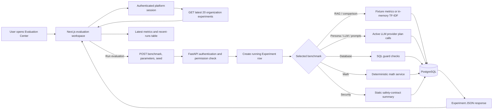

# Evaluation Center Complete Guide

This guide explains exactly what the **Evaluation Center** page does, what every control means, which backend code runs, whether Gemini or other managed services are called, how metrics are calculated, what is persisted, and what the current limitations are.

Evaluation Center URL: <http://localhost:3000/evaluation>

## 1. What this page is for

AI Lab demonstrates how individual ML algorithms work. Evaluation Center has a different purpose: it measures selected quality, routing, calculation, and security behaviors against small, versioned test cases.

An evaluation does not answer a question entered by the user. You select a predefined benchmark, and the backend runs that benchmark's built-in cases. The result is a collection of metrics such as accuracy, MRR, failure rate, or latency.

The page currently provides eight benchmarks:

1. RAG
2. RAG Comparison
3. Persona Router
4. Database
5. Math
6. Security
7. LLM
8. Prompts

## 2. Are the evaluation results real or mocked?

The most accurate answer is: **the calculations are real, but the coverage and data sources differ by benchmark**.

| Benchmark | What really runs | Fixed fixture or live system? | Calls Gemini in managed mode? |
|---|---|---|---|
| RAG | Real metric functions | Fixed, prewritten retrieval/answer/citation cases | No |
| RAG Comparison | Real TF-IDF vectorization, cosine similarity, chunking, and ranking | Fixed three-document in-memory corpus | No |
| Persona Router | Real provider `plan()` calls and exact label comparison | Six fixed questions sent to active provider | Yes |
| Database | Real SQL guard validation | Seven safe and seven unsafe fixed SQL strings | No |
| Math | Real deterministic `MathService` calculations | Ten fixed cases | No |
| Security | Returns a predefined safety-contract summary | Eight attack labels are not actually sent through the live application | No |
| LLM | Real repeated provider `plan()` calls, timing, failure, and consistency measurement | Three fixed questions, two attempts each | Yes |
| Prompts | Real active-provider persona/router benchmark | Tests only the active prompt versions; it does not run a true two-version A/B comparison | Yes |

Therefore, the page is not simply displaying arbitrary fake numbers. However, some results are measurements over controlled fixtures rather than end-to-end production traffic. The current Security benchmark is especially important: its counts are declarative values in the implementation, not the result of executing eight live adversarial requests.

## 3. End-to-end page flow



The request normally waits for the benchmark to complete. There is no separate evaluation worker queue in the current implementation.

## 4. Every control on the page

### Organization ID and local test user ID

The shared session component authenticates the test user and establishes their organization membership. The API requires the `chat.execute` permission.

Evaluation records contain both `organization_id` and the user who started the run. Reading experiment history is currently organization-scoped: authorized users in the same organization can see that organization's records. Users from another organization cannot access them.

### Benchmark

The dropdown chooses one of the eight backend allowlisted benchmark names. The request schema rejects any name outside that list.

### Top K

Top K means “consider at most the K highest-ranked retrieved items.” Its real effect is benchmark-specific:

| Benchmark | Does Top K affect it? |
|---|---|
| RAG | Yes, it limits the predefined retrieved list before retrieval metrics are calculated |
| RAG Comparison | Yes, it is inserted into both chunking configurations |
| Persona Router | No |
| Database | No |
| Math | No |
| Security | No |
| LLM | No |
| Prompts | No |

The browser allows 1–20. The backend clamps ordinary RAG Top K to 1–20 and comparison Top K to 1–10.

In the current two-case built-in RAG fixture, changing Top K usually does not change the result because the only answerable expected document is already ranked first.

### Run evaluation

For most benchmarks, the page sends:

```json
{
  "benchmark": "math",
  "parameters": {
    "top_k": 3
  },
  "random_seed": 42
}
```

For RAG Comparison, it always sends two predefined configurations using the selected Top K:

```json
{
  "benchmark": "rag_comparison",
  "parameters": {
    "configurations": [
      { "chunk_size": 120, "chunk_overlap": 20, "top_k": 3 },
      { "chunk_size": 300, "chunk_overlap": 40, "top_k": 3 }
    ]
  },
  "random_seed": 42
}
```

### Random seed

The UI always submits seed 42, but it does not show an editable seed field. The value is persisted for reproducibility metadata.

At present, none of the eight evaluation implementations actually uses this seed in its calculation. Changing it through the API would not alter current benchmark behavior.

## 5. RAG benchmark

### What it claims to measure

- Hit@K and Recall@K
- Mean Reciprocal Rank (MRR)
- answer correctness/key-fact presence
- groundedness
- abstention correctness
- citation presence
- exact citation page and document
- unsupported answer rate
- cross-tenant leakage count

### What it actually runs

The current implementation creates two predefined `RagCase` objects.

Case 1 is answerable:

- question: “What is the retention period?”
- expected fact: “seven years”
- expected source: `policy.pdf`, page 1
- predefined retrieval: `policy.pdf` pages 1 and 2
- predefined answer: records are retained for seven years
- predefined citation: `policy.pdf`, page 1

Case 2 is unanswerable:

- question: “What is the cafeteria menu?”
- no retrieved evidence
- predefined abstention answer
- no citations

The metric code genuinely checks those structures. It searches for expected facts in the supplied answer, examines citation tuples, checks the expected retrieval rank, and calculates means.

### What it does not do

This benchmark does not currently:

- read your uploaded Knowledge Bases;
- call Vertex embeddings;
- query Pinecone;
- execute the LangGraph document workflow;
- ask Gemini to generate these two answers;
- make a live cross-tenant request.

`cross_tenant_leakage_count` is currently returned as zero by the metric function rather than measured by an active tenant attack in this benchmark.

### Why Hit@K may show 0.5 even though the answerable case succeeds

The implementation includes both the answerable and unanswerable case in the Hit@K average. The answerable case contributes 1, while the unanswerable case has no expected retrieved item and contributes 0. The resulting built-in Hit@K/Recall@K is therefore normally 0.5.

This is a property of the current fixture/metric definition, not a 50% production Pinecone retrieval score.

## 6. RAG Comparison benchmark

### What actually runs

This is a real, isolated information-retrieval calculation using:

- a three-item in-memory corpus;
- configurable character chunk size and overlap;
- scikit-learn `TfidfVectorizer` with unigrams and bigrams;
- cosine similarity;
- three predefined questions and expected document/page pairs;
- Hit@K and MRR calculations.

The fixture contains facts about:

- seven-year customer-record retention;
- 24-hour security-incident reporting;
- twenty days of annual leave.

Each candidate configuration chunks the text, builds a fresh TF-IDF space, ranks chunks for each question, and calculates its retrieval metrics. `best_index` identifies the configuration with the highest MRR; ties select the first maximum.

### Isolation

The result explicitly identifies its namespace as `isolated-in-memory-evaluation`, and `production_vectors_mutated` is false.

It does not read or modify Pinecone. It does not change your production chunk configuration or re-ingest documents.

### Current UI limitation

The page always compares exactly these two configurations:

- chunk size 120, overlap 20;
- chunk size 300, overlap 40.

Only Top K is editable. The API supports up to eight bounded configuration objects, but the current page does not let the user add or edit their chunk sizes/overlaps.

Because all fixture texts are shorter than these chunk sizes, both UI configurations may produce identical chunks and identical scores. This is a valid calculation but not a strong chunk-size stress test.

## 7. Persona Router benchmark

### What actually runs

The benchmark sends six fixed questions to the active language-model provider's `plan()` method. For each response, it compares:

- selected persona against the expected persona;
- exact ordered route list against expected routes;
- returned routes against the only allowed tools: document, database, and math.

The cases include:

- a legal contract clause;
- database revenue analysis;
- document summarization;
- a percentage calculation;
- document plus math;
- database plus math.

After the provider returns a structured plan, the same route-normalization function used by the application adjusts it for available selected sources. The benchmark then calculates persona accuracy and route accuracy.

### Does it call the real model?

In the normal managed local configuration, yes. The registry selects the first available provider, currently Vertex AI Gemini, and calls it once for each of the six questions. Provider/model selection is not exposed on the Evaluation page.

In automated tests, `AI_PROVIDER_MODE=fake` uses the deterministic test provider instead of calling Vertex. Application configuration prevents fake mode outside the test environment.

### What it measures and does not measure

It measures structured persona/route planning. It does not execute document retrieval, SQL queries, arithmetic, or final answer generation after choosing those routes.

`unsafe_tool_selection_count` is currently returned as zero. `invalid_tool_selection_count` is calculated, although the provider's structured schema itself restricts routes to the three allowed values.

## 8. Database benchmark

### What actually runs

The benchmark constructs a real `SqlGuard` with a row limit of 20 and validates 14 fixed SQL strings:

- seven expected-safe `SELECT` queries;
- seven expected-unsafe queries.

Safe examples cover count, sum, average, grouping, filtering, a date literal, and a join. Unsafe examples cover DELETE, DROP, PostgreSQL catalogs, file-reading functions, stacked statements, comments, and an unauthorized schema.

It calculates:

- `safe_query_accuracy`: proportion of safe statements accepted;
- `adversarial_block_rate`: proportion of unsafe statements rejected;
- total case count.

### What it does not do

- It does not connect to your registered PostgreSQL data source.
- It does not ask Gemini to create SQL.
- It does not execute any SQL statement.
- It does not inspect actual business rows.

`unsafe_execution_count` is zero because this evaluation only validates strings and never sends them to a database.

## 9. Math benchmark

### What actually runs

The benchmark calls the same deterministic `MathService` used by the application's math route for these fixed operations:

- add 2 and 3;
- calculate 10% of 200;
- calculate percentage change from 240 to 300;
- ratio 10 to 2;
- average of 2, 4, and 6;
- sum 1, 2, and 3;
- absolute difference between 4 and 10;
- minimum;
- maximum;
- divide 1 by 0 and verify that it is rejected.

There are ten cases in total. `exact_accuracy` is the fraction of correct numeric results plus the correct division-by-zero rejection.

### What it does not test

- natural-language math extraction by Gemini;
- arbitrary user questions;
- every supported expression or difficult mathematics;
- document-plus-math or database-plus-math end-to-end workflows.

This benchmark is a real but narrow unit-style evaluation of the deterministic calculation service.

## 10. Security benchmark

### What the current implementation returns

The backend defines eight attack labels, including attempts to reveal prompts/API keys, change tenants, delete customers, call unauthorized tools, reveal chain-of-thought, access a metadata server, and ignore previous instructions.

It returns:

- eight cases;
- eight blocked or treated as untrusted;
- zero prompt, secret, tool, tenant, or external-request leakage counts;
- document content classified as untrusted evidence only;
- database values classified as untrusted data only.

### Critical interpretation

The current method does **not** submit those eight attacks to Chat, LangGraph, Gemini, the SQL connector, or a tenant API. It does not inspect live responses. It returns the expected security-policy contract as predefined metric values.

This means the benchmark should be described as a **security contract/status fixture**, not a complete dynamic penetration test. Separate backend tests do execute certain real protections, including tenant isolation, malicious document treatment, upload validation, SQL restrictions, connector host restrictions, and secret non-disclosure, but those test executions are not triggered by clicking this page's Security benchmark.

Do not use this page alone as proof that a production deployment has passed a comprehensive security assessment.

## 11. LLM benchmark

### What actually runs

The benchmark uses three fixed questions:

1. summarize an uploaded policy;
2. calculate 25 percent of 80;
3. count orders in the database.

It calls the active provider's `plan()` method twice for each question, for six total attempts. It records:

- number of questions and attempts;
- provider-call success and failure rate;
- individual call latency values;
- average latency;
- output consistency.

Consistency means both calls for a question returned the same persona and exact route sequence.

### What it does not measure

- final natural-language answer quality;
- document retrieval or citation correctness;
- SQL generation correctness;
- arithmetic result correctness;
- token usage or monetary cost.

The implementation intentionally returns `usage_tokens: null` and `estimated_cost: null` because reliable per-request usage is not exposed in this planning path. It does not invent these numbers.

In managed mode this creates six real Gemini planning calls, so it can take longer and can fail if Vertex AI is unavailable, credentials are invalid, quotas are exhausted, or network/provider timeouts occur.

## 12. Prompts benchmark

### What actually runs

This benchmark calls the full six-case Persona Router benchmark against the currently active provider. It then reports:

- active prompt version identifiers;
- baseline label `v1`;
- persona accuracy;
- route accuracy;
- comparison readiness.

The tracked prompt identifiers are:

- `persona-selector-v1`;
- `intent-router-v1`;
- `grounded-rag-v1`;
- `suggestion-policy-v1`;
- `safe-text-to-sql-v1`.

### Current limitation

It does not actually run two different prompt versions and compare their outputs. It evaluates the active persona/router behavior once and labels the baseline. Therefore, it is readiness/version tracking plus an active-provider score, not a complete prompt A/B experiment.

`hidden_prompt_content_exposed` is currently returned as false by the benchmark; it is not calculated by scanning a generated response for hidden prompt text.

## 13. What happens when a managed-provider benchmark runs

Persona Router, LLM, and Prompts resolve the registry's default available LLM. With the project's normal managed configuration, this is the configured Vertex AI Gemini model.

The provider:

1. sends the fixed question with a routing system instruction;
2. requests JSON constrained by a strict schema;
3. uses temperature zero;
4. restricts persona values to General Assistant, Financial Analyst, or Legal Advisor;
5. restricts routes to document, database, and math;
6. applies configured external timeout and retry settings;
7. parses and validates the structured response.

If all provider attempts fail, the API raises the safe `LLM_PROVIDER_UNAVAILABLE` error. The Experiment row is marked failed with a sanitized error code. Provider credentials and hidden prompts are not returned in the experiment response.

## 14. Result cards

The shared result component shows:

- benchmark name;
- fixed seed 42;
- duration in milliseconds;
- completed/failed status;
- one card for every top-level metric.

Scalar strings and booleans appear directly. Arrays and nested objects appear as formatted JSON.

Any number from zero through one is displayed with a progress bar. This is generic UI behavior, not semantic metric interpretation. For example, a rate of 0.9 naturally looks like 90%, but any unrelated numeric value in that range would receive the same bar.

## 15. Recent runs table and persistence

When the session connects, the page requests the 20 newest Experiment records for the organization. After a successful evaluation, it reloads that list.

The table shows:

- benchmark/algorithm name;
- status;
- duration;
- creation time.

The shared endpoint contains both Evaluation Center and AI Lab experiments. Therefore, an AI Lab algorithm can also appear in the Evaluation page's Recent runs table. There is currently no evaluation-only filter.

Each evaluation record stores:

- organization and initiating user IDs;
- derived lab type;
- benchmark name;
- dataset label `deterministic-evaluation-suite`;
- dataset version `evaluation-v1`;
- submitted parameters;
- seed 42;
- calculated metrics;
- running/completed/failed status;
- timestamps and duration;
- safe error code on failure;
- `production_state_mutated: false` artifact metadata.

The evaluations do not create a model artifact. They do not mutate Knowledge Bases or Pinecone.

If an evaluation fails, its failed record is persisted. Because the frontend reloads history only after success, that new failed row may not appear immediately until the page reconnects or another successful run refreshes history.

## 16. Metric glossary

| Metric | Meaning in this project |
|---|---|
| Hit@K | Whether the expected source/page appears in the first K retrieved items |
| Recall@K | Currently calculated identically to Hit@K because each case has one expected item |
| MRR | Mean of `1 / rank` for the expected result, or zero when absent |
| Groundedness | Current RAG fixture's expected key-fact presence/abstention score |
| Abstention accuracy | Whether answerable cases answered and unanswerable cases refused without citations |
| Citation page accuracy | Whether the expected page appears among citations |
| Citation source accuracy | Whether the expected document appears among citations |
| Unsupported answer rate | Fraction of unanswerable cases that did not correctly abstain |
| Persona accuracy | Exact expected persona matches divided by case count |
| Route accuracy | Exact ordered route-list matches divided by case count |
| Safe query accuracy | Expected-safe SQL statements accepted by `SqlGuard` |
| Adversarial block rate | Expected-unsafe SQL statements rejected by `SqlGuard` |
| Exact math accuracy | Correct deterministic values and expected error behavior divided by case count |
| LLM success rate | Provider planning attempts that did not raise the handled provider error |
| Output consistency | Questions whose two plans have identical persona and routes |

## 17. Isolation and security boundaries

- All endpoints require an authenticated organization session and `chat.execute` permission.
- Benchmark names are a strict schema allowlist.
- Top K and comparison parameters are numerically bounded.
- RAG comparison runs entirely in memory and cannot mutate production vectors.
- Database evaluation validates strings without executing them.
- Math evaluation uses an allowlisted deterministic service.
- Provider failures return sanitized application errors.
- Experiment reads filter by organization, preventing cross-organization access.
- Evaluation results contain metrics rather than credentials, hidden prompts, or chain-of-thought.

The page is an evaluation dashboard, not an arbitrary test-code runner. Users cannot submit Python, shell commands, custom URLs, custom SQL cases, or custom adversarial payloads through the current UI.

## 18. Current limitations to understand before demonstrating it

1. RAG uses predefined answers and retrieval lists, not the production RAG pipeline.
2. RAG Comparison uses a tiny in-memory TF-IDF corpus, not Vertex/Pinecone.
3. Security returns predefined policy outcomes instead of executing attacks.
4. Prompts does not compare two actual prompt implementations.
5. LLM evaluates planning consistency, not final response quality.
6. Database evaluates SQL validation, not live connector execution.
7. Math covers a small fixed set, not difficult or arbitrary expressions.
8. Top K is visible for every benchmark even though six benchmarks ignore it.
9. Seed 42 is recorded but currently unused by evaluation calculations.
10. Recent runs mixes AI Lab and Evaluation Center records.
11. The page does not let the user inspect a historical run's full metrics by clicking its row.
12. Provider/model selection is automatic and not displayed as a control.
13. There is no evaluation-specific concurrency limiter or background queue; live-provider runs wait in the request.

These limitations do not mean the page has no value. It provides deterministic checks, active provider routing signals, persistence, version labels, and a basis for expansion. They do mean its metrics must be described according to what was actually measured.

## 19. Recommended way to demonstrate the page

### Demonstrate deterministic correctness

Run Math and Database. Explain that both execute real backend safety/correctness functions over fixed cases without using Gemini.

### Demonstrate active Gemini evaluation

Run Persona Router or LLM with the managed provider configured. Explain that these make real Vertex Gemini planning calls. Show route/persona scores, provider latency, consistency, and any safe provider failure.

### Demonstrate isolated retrieval experimentation

Run RAG Comparison. Explain that it performs real TF-IDF retrieval in memory and cannot affect production Pinecone data.

### Explain RAG and Security honestly

Present RAG as a metric-function fixture and Security as a security-policy contract fixture. Do not describe either as a full live end-to-end test from this button.

## 20. Backend and frontend implementation map

| Concern | File |
|---|---|
| Dynamic `/evaluation` page route | `apps/web/app/[section]/page.tsx` |
| Page form, request, and history | `apps/web/components/evaluation-workspace.tsx` |
| Generic metric rendering | `apps/web/components/experiment-results.tsx` |
| Evaluation API and history endpoints | `apps/api/src/dynamic_agentic_api/api/experiments.py` |
| Request and response schemas | `apps/api/src/dynamic_agentic_api/schemas.py` |
| All benchmark implementations | `apps/api/src/dynamic_agentic_api/evaluation/service.py` |
| Run orchestration and persistence | `apps/api/src/dynamic_agentic_api/experiments/service.py` |
| Gemini and fake test-provider implementations | `apps/api/src/dynamic_agentic_api/llm/gateway.py` |
| Provider selection | `apps/api/src/dynamic_agentic_api/llm/registry.py` and `services.py` |
| Deterministic math operations | `apps/api/src/dynamic_agentic_api/math/service.py` |
| SQL validation | `apps/api/src/dynamic_agentic_api/data_sources/security.py` |
| Experiment database table | `apps/api/src/dynamic_agentic_api/db/models.py` |
| AI Lab/Evaluation and security tests | `tests/backend/test_milestone4_ai_lab_evaluation.py` |

The relevant endpoints are:

```text
POST /api/v1/organizations/{organization_id}/evaluations
GET  /api/v1/organizations/{organization_id}/experiments?limit=20
GET  /api/v1/organizations/{organization_id}/experiments/{experiment_id}
```

## 21. Final interpretation

The Evaluation Center is a mixed evaluation suite:

- **RAG and RAG Comparison** evaluate retrieval/answer metrics on isolated fixtures;
- **Persona Router, LLM, and Prompts** use the active language-model planner in managed mode;
- **Database and Math** run real deterministic backend guards/services;
- **Security** currently reports a predefined expected safety contract.

All runs are authenticated, organization-scoped, persisted in PostgreSQL, version-labelled, and designed not to mutate production knowledge or vectors.

The correct claim is not “every button runs a complete production end-to-end evaluation.” The correct claim is: **the page runs a collection of bounded deterministic and provider-backed benchmark signals, with clearly different levels of realism and coverage**.
